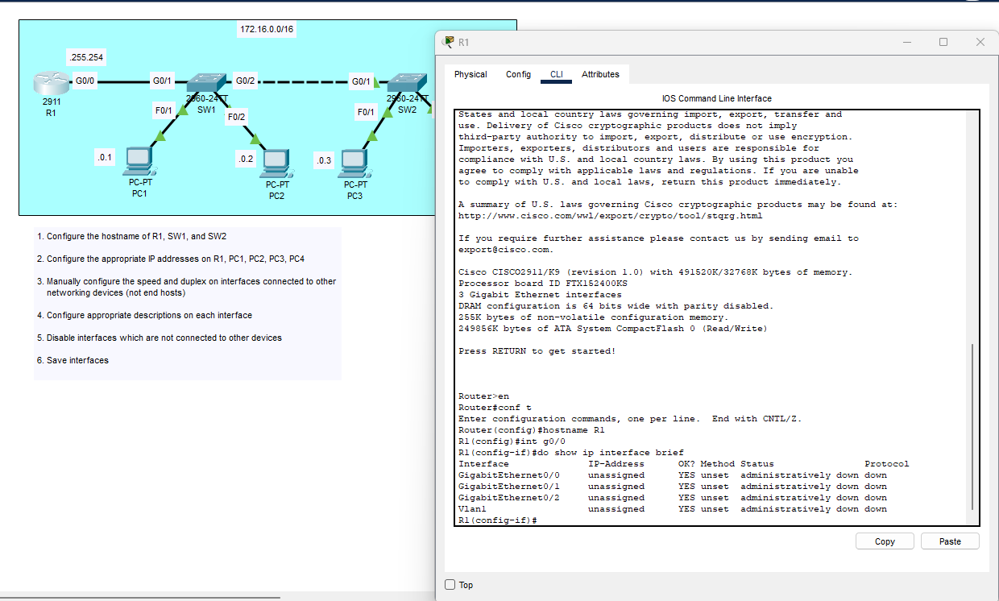

### Lab overview

### Initial configuration of R1 (changed hostname)

As you can see, with the 'show ip interface brief' command, we can see that all of the interfaces are not configured.

### Configuration of R1's G0/0 interface connecting to SW1

### Saving the configuration and then confirming we saved it properly to the startup-config

### Configuring the IP of all PCs

### Looking into Switch 1, we change the hostname to SW1 and view the interfaces. As we can see, they are all defaulted.

### All configurations to SW1 are made (R1, SW1, end hosts, interfaces not in use)

### A fully configured SW2

This lab is now complete
