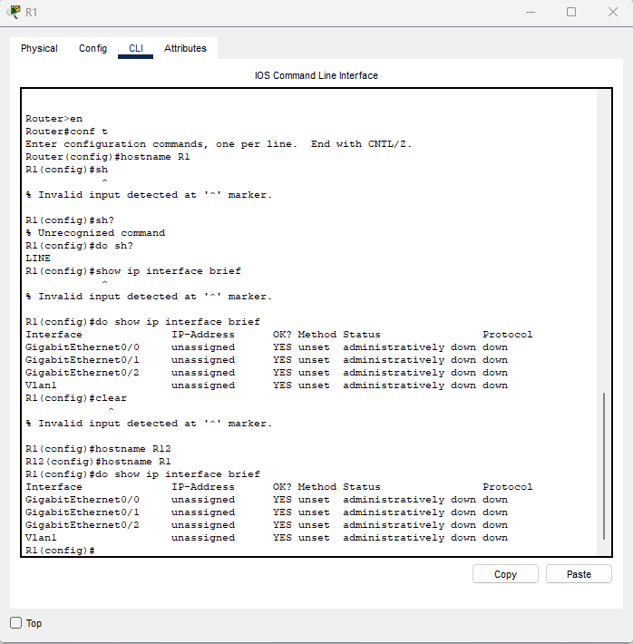
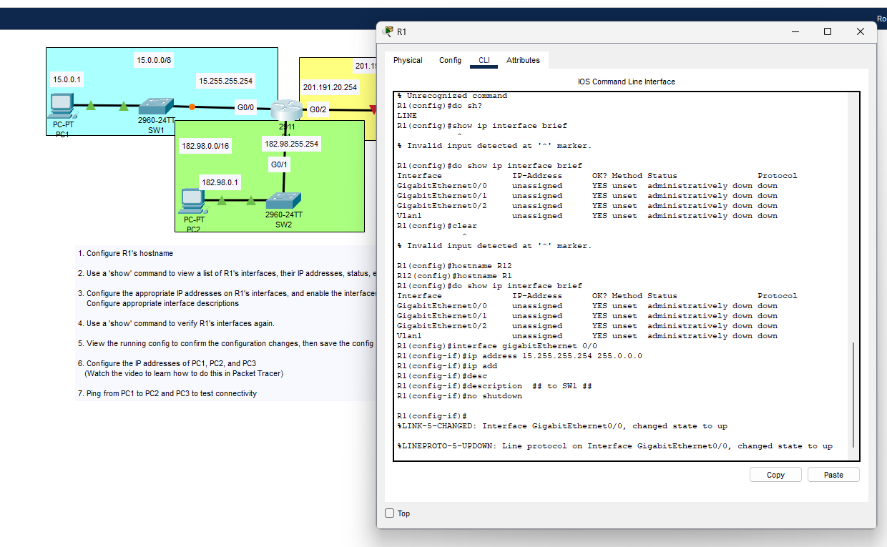
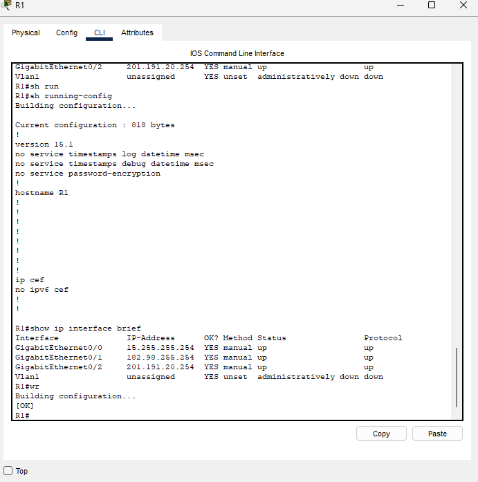
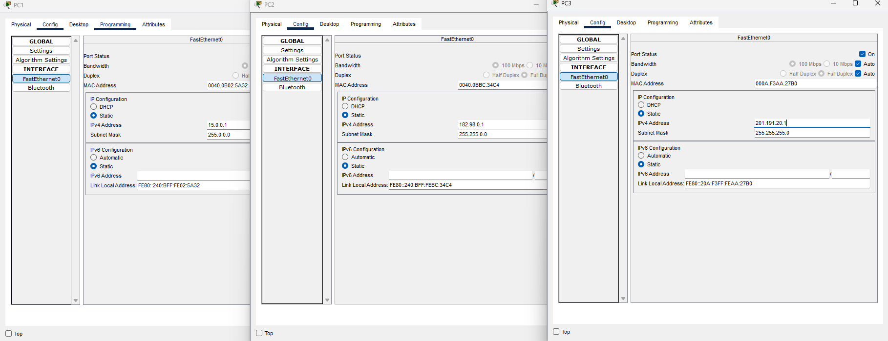
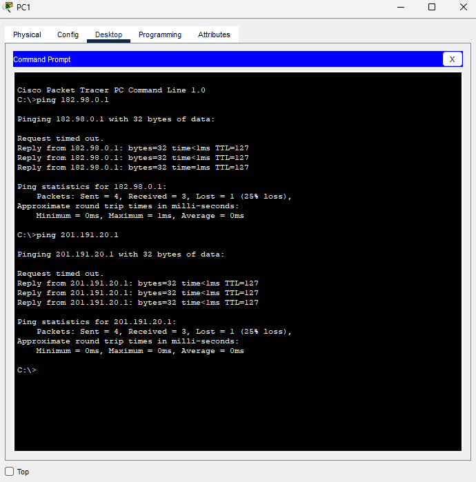

### Initial Network Topology & Lab overview

### Configuring the router hostname and using the 'show' command to view R1's interfaces

### Configuring the router interfaces

### Once all interfaces are configured to their respective switches, use the 'show' command to confirm all configurations are correct

### Now we can configure the static IP addresses of each PC

### And finally, we can use the 'ping' command from PC1 to test connectivity to PC2 and PC3

This lab is now complete.
