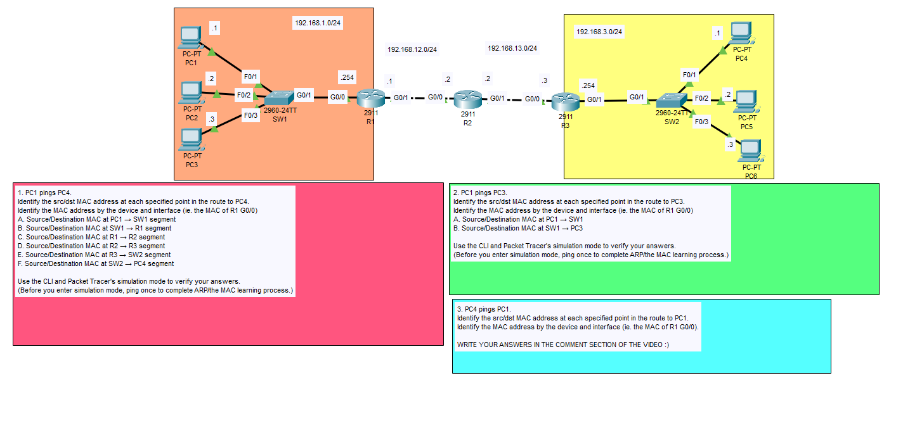
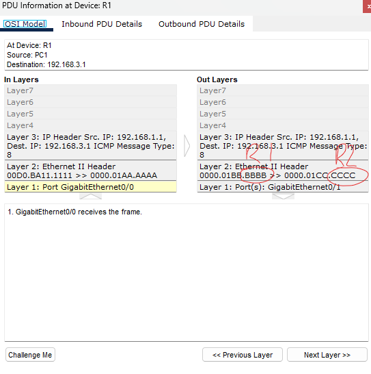

### Lab overview

### First, let's check the MAC address of PC1 and R1

We can see that the MAC address for PC1 ends in "1111" and the MAC address for R1 ends in "aaaa"

*Note, the MAC address of R1's G0/0 interface is manually configured to be aaaa. This is different than the BIA (Burned-in address).

### After performing a ping from PC1 to PC4, we can see that the destination MAC for the initial frame is in the direction of the default gateway of PC1 (R1)

### Taking it a step further, we can see that the destination MAC from R1's G0/1 interface is now set to R2's G0/0 interface. (Traveling down the path)

For the sake of my time, you can assume that the MAC addresses are in sequential order (AAAA, BBBB, CCCC, DDDD, EEEE, FFFE, etc...) down the line, just so I don't have to put a screenshot checking every router's MAC address.

### And finally, at R3, we can see as soon as the packet arrives at R3, it has the destination MAC to PC4 directly coming from R3's G0/1 interface.

Now, when the packet goes through 192.168.3.0/24 LAN, the switch will not need to change the src/dst MAC address. Switches will flood the network to find a MAC that they do not know (an unknown broadcast) and get a reply from the MAC they are looking for with a known unicast. 

### Let's check what happens if PC1 pings PC3 (within the same LAN)

We can see that at SW1, it simply takes the frame and forwards it. It makes no changes.

### Extras

Some checks that I did for the rest of the lab

- The src/dst MAC addresses when PC4 pings PC1 at each specified route to PC1
- Identified the MAC address by the device and interface

This lab is now complete.
