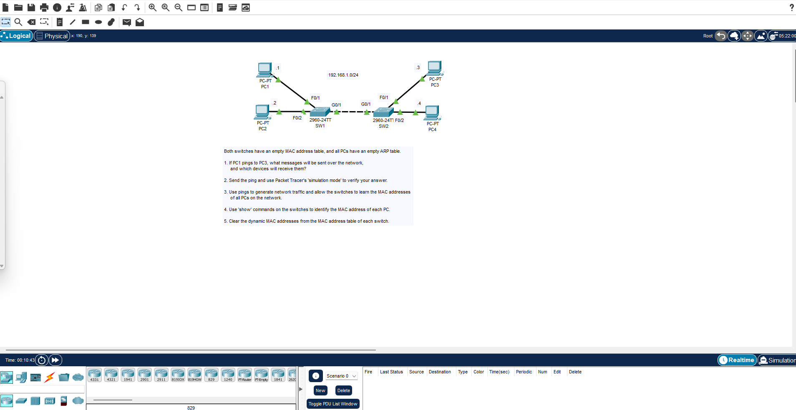
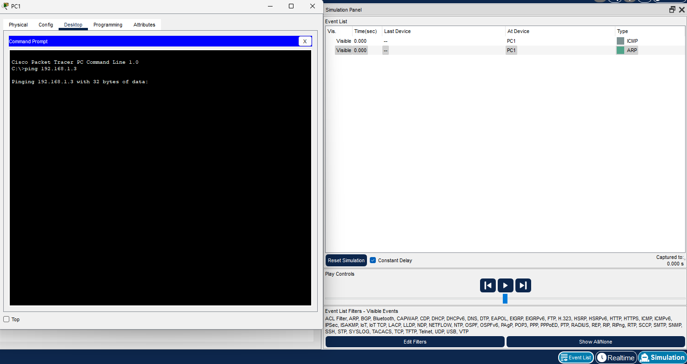
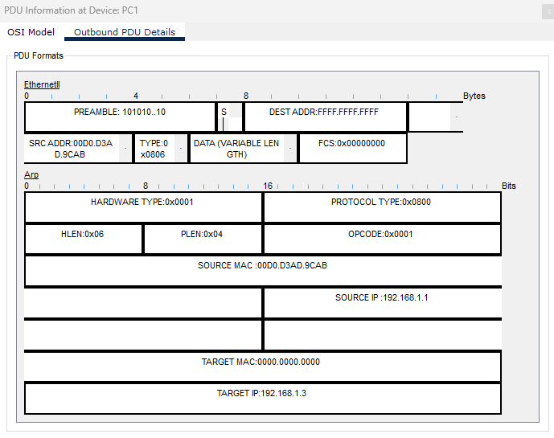
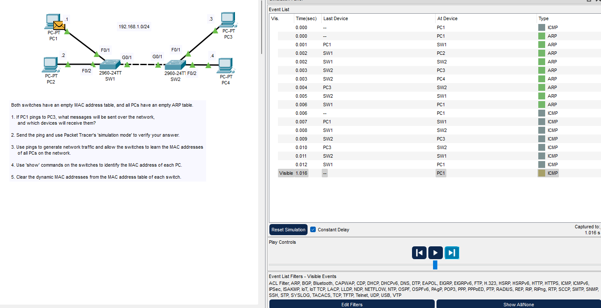
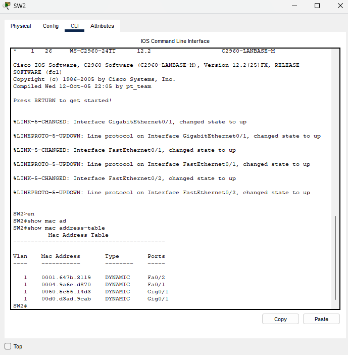
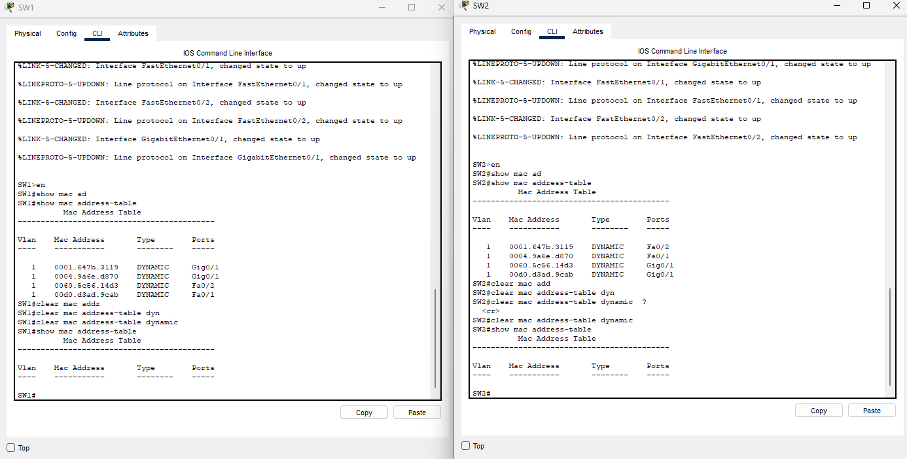

### Network Diagram and initial instructions

### Initially, we are dealing with a network in which all MAC address tables and ARP tables are completely empty. Understanding the process of discovery is the goal of the first step.

- **Step 1**: PC1 pings PC3. Initially, PC1 HAS to know PC3s MAC address. Until PC1 knows PC3s MAC address, it can't send a ping. This is done with anARP request. PC2, PC3, and PC4 will all receive this ARP request. PC2 and PC4 will ignore the ARP request.
- **Step 2**: After PC3 receives the initial ARP request, it will send a unicast ARP reply to PC1.
- **Step 3**: Now that PC1 has PC3's MAC in its MAC address table, will send an ICMP Echo request which will be received by PC3. This is a unicast message. 
- **Step 4**: PC3 will then send an ICMP Echo reply which is also unicast and will only be received by PC1. The ping is now complete.

### Initial ping shown in Packet Tracer

Immediately, we are shown both an ARP and ICMP message.

### Initial ARP Request from PC1 details

We can see that it is a broadcast ARP message from looking at the PDU details. (FF:FF:FF:FF:FF:FF)

### Fast forwarding through the simulation, we can see the ARP message goes to every PC and is dropped by all PCs except for PC3.

### Now, PC1 is able to send its ICMP Echo Request to PC3.

As shown in the screenshot, the ping goes through the network to PC3, PC3 then sends its ICMP Echo Reply back to PC1. These are both Unicast.

### MAC address table of SW1 and SW2 after pings

After pinging PC4 from PC2, we will now inspect the MAC address table of SW1 and SW2 to show all MAC address of all PCs in the network.

### Clearing all dynamically learned MAC addresses

The lab is now complete.
