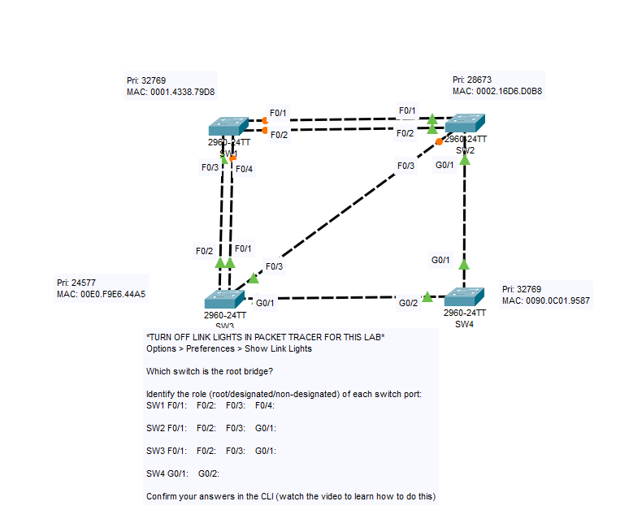
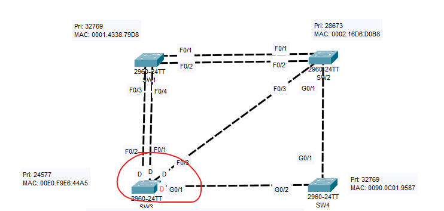
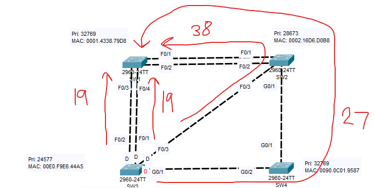
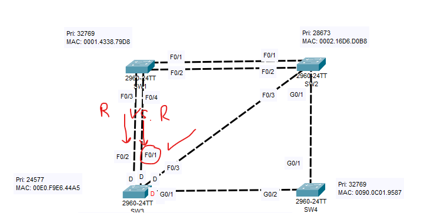
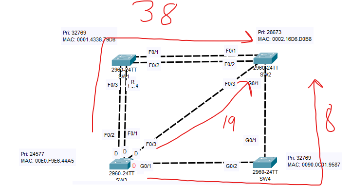
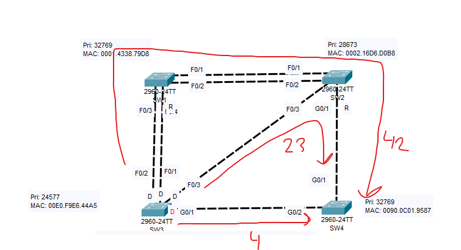
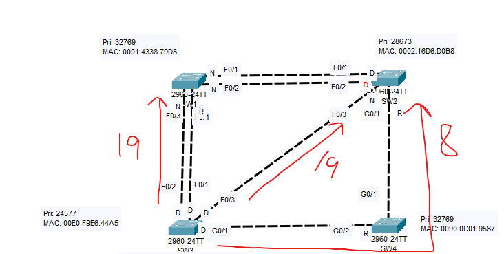
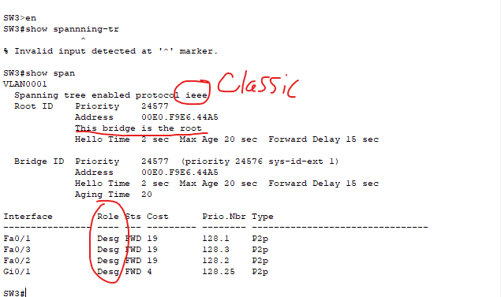
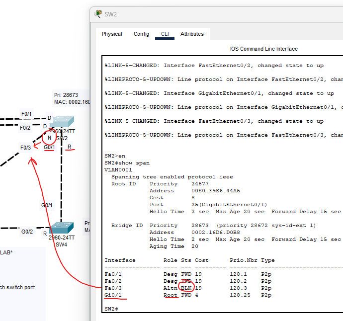

### Lab overview

Looking at the initial overview, we can see a few Bridge IDs:
- SW1: priority=32769
- SW2: priority=28673
- SW3: priority=24577
- SW4: priority=32769

In STP, the switch with the lowest bridge ID will be selected as the root bridge.

In this case, our root bridge will be: Switch 3.

### Next up, let's find the root ports.

Firstly, we can assign all the interfaces on SW3 with the Designated status.

Each other switch in the topology must have a single root port. The first determining factor of selecting root ports is ROOT COST.

Looking at the different paths our BPDUs can take, we examine the root cost through each outgoing interface on the root bridge.

It looks like our clear winner is out of either the:
- F0/1
- F0/2
Interface.

We have 3 factors that determine the root port:

- Lowest root cost
- Neighbor with lowest bridge ID
- Lowest neighbor port ID

Since the tier is out of the same interface going toward the same switch, we can rule out the "neighbor with lowest bridge ID" factor because that has to compare 2 switches.

Our next factor to determine the proper root port is the lowest neighbor port ID.

Here we can see that the ports coming out of our root bridge are designated. Since we are selecting the root port, we look to SW1. On SW1 we have: F0/3, F0/4. They are in a tie.

We must compare them to whoever has the neighbor with the lowest port ID.

F0/1 is the clear winner, being lower than F0/2.

Here we can see SW2's root port selection. The lowest root cost will be going through SW4 and to SW2.

SW2's G0/1 interface will be selected as Root.

And finally, for SW4. A very clear winner.

SW4's G0/2 interface will be selected as Root.

### Root cost values

Just to serve as a reminder, the root cost values are:

- 100: Ethernet
- 19: Fast ethernet
- 4: Gigabit ethernet
- 2: 10 Gigabit ethernet

This is for classic STP, IEEE 802.1D

There is an updated chart that is out of scope for this lab.

### Now, the Non-designated ports

Now that we have all of our root ports, we can label the rest of the ports as either designated or non-designated. The way to choose the switch with the designated ports is the same. 

The switch with the lowest root cost will have its interfaces designated, the others will be non-designated.

Here is the CLI output for SW3 after using the command "show spanning-tree" in privileged EXEC mode.

We can see that we are using classic spanning tree (PVST). It tells us that SW3 is the root, the root cost of each port, and how every port is designated.

And finally, here we can see SW2. It shows us which ports are blocked, designated, and the root port.

This verifies our analysis of STP.

This lab is now complete.
