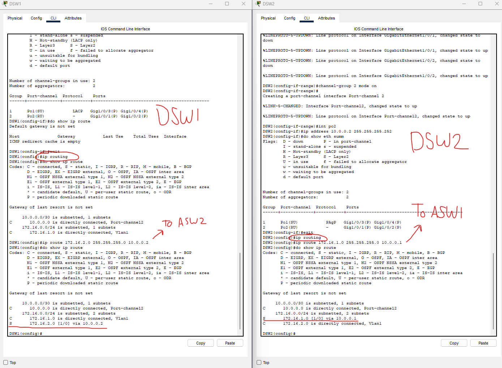

### Lab overview

We get our first look into network architecture in this lab with the Access-layer Switches and Distribution-layer switches. Exciting stuff!

We can see that there are two Gigabit interfaces on ASW1 which are connecting to DSW1. Because of spanning tree, G0/2 is in a discarding state (alternate port role). This means it is an active backup incase anything happens to G0/1.

We will configure G0/1 with G0/2 together using LACP, effectively combining both physical interfaces as one logical interface.

Using the 'channel-group' command, we can group the interfaces together in LACP mode. (active/passive is LACP, auto/desirable is PAgP)

We created a channel-group on port-channel 1, we then switch into the 'po1' (portchannel1) interface and enable it as a trunk.

Looking at the EtherChannel settings with the 'do show etherchannel summary' command, we can see that our interfaces have the "down" and "stand-alone" flags.

This is because we haven't configured the other side of the connection yet (DSW1).

Let's do that.

### Configuring DSW1 using LACP and as Trunk

Running the same configurations on DSW1's G1/0/3-4 interfaces will now flag all of our interfaces on this EtherChannel connection as "Layer 2" (S) and "In use" (U).

We also have the flag (P) "in port-channel" which is what we want to see!

Let's look at an updated spanning-tree from ASW1.

Our G0/x interfaces are now gone and replaced with the Po1 interface! This is an LACP configured EtherChannel.

Higher up in the screenshot, we can also see that it was updated with the flags (SU) and (P), Meaning we are up and running.

### Configuring ASW2 and DSW2 with PAgP and as Trunk

Running similar configurations on the interfaces between ASW2 and DSW2, we can achieve the same results.

This time, however, we are going to use 'desirable' mode, which is for Port Aggregation Protocol (PAgP).

CLI confirmation of our configuration.

We also confirm that DSW2 is the root bridge in this network topology.

### Configuring static EtherChannel between DSW1 and DSW2

We are instructed to configure a Layer 3 STATIC EtherChannel between DSW1 and DSW2.

As denoted by the stars in the screenshot, to enable these interfaces as layer 3 (routing), we must disable switchport 'no switchport' and assign them IP addresses.

Since port-channel 1 is already taken with the connections to ASW1 and ASW2, we have to use port-channel 2.

We do not use passive, active, desirable, or auto. We use 'on' which is for static etherchannel.

### Configuring routes to allow the PCs to each SRV1

Enabling 'ip routing' will give us our local and connected routes.

To get end-to-end network connectivity, we will configure a static route from DSW1 to DSW2 (and vice versa).

This is done using the 'ip route (dst ip) (dst mask) (next-hop ip).

We confirm our configurations in the CLI.

### Ping from PC1 to SRV1

Here we confirm that we have connectivity from PC1 to SRV1.

ICMP Echo Request:
PC1 -> ASW1 -> DSW1 -> DSW2 -> ASW2 -> SRV1

ICMP Echo Reply:
SRV1 -> ASW2 -> DSW2 -> DSW1 -> ASW1 -> PC1

(The initial "Request timed out" in the ping are due to the ARP process having to complete)

### Checking the default EtherChannel load-balancing method used on each switch

We see that the switches load-balance using Source MAC address, meaning all frames from the same source MAC will always use the same member interface of the EtherChannel.

We configure this to change it so that it is no longer source MAC, but now source/destination ip.

We do this configuration for all remaining switches.

This lab is now complete.

