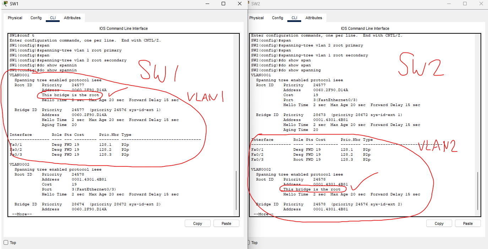

### Lab overview

### First thing we want to do is verify the root bridge using the CLI

We can see that SW2 is the root bridge.

Now, analyzing all the role/states of each port on each switch...

I've marked each port and their role/state. This is verified through the CLI screenshot from earlier.

### Configuring load balancing

We're going to make SW1 the primary root for VLAN1 and secondary root for VLAN2.

We will do the same for SW2, but vice versa.

With this, we have configured load balancing.

We can verify in the CLI. The roles and states are also shown.

### Increasing the cost of SW4's F0/2 interface to 100.

We can see F0/2 has the root role. We are going to increase the F0/2 cost. This should make the switch select a different root port.

Here we can see that it quickly switched its interfaces. F0/1 is now in the listening state.

When transitioning from a blocking state to a forward state, ports must go through this phase:
- Blocking state
- Listening state (15 seconds)
- Learning state (15 seconds)
- Forwarding state

This is so that it can't be switched too fast to cause a broadcast storm.

### Increasing priority of SW1's F0/1 to 240.

Let's check SW3's root port for VLAN1.

We can see that it is F0/1, the port which is directly connecting to SW1's F0/1 interface.

Now, if we set the priorty of SW1's F0/1 interface to 240, will this affect SW3's root port selection?

It shouldn't. Sender port ID is the last tie breaker, AFTER port cost and sender bridge ID. 

Because F0/1 has a lower root cost than F0/2, the port priority should have no effect.

Let's verify.

I've increased the port priority to 240.

As expected, there is no change. F0/1 is still the root port.

### Finally, let's configure Portfast and BPDU guard

We can do the same for SW4 and we are all set!

This lab is now complete.
