### Lab overview

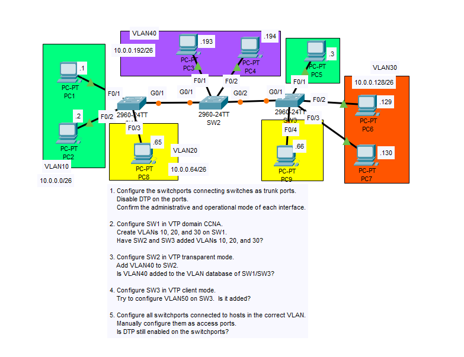

### Step 1: Disable DTP on ports connecting switches

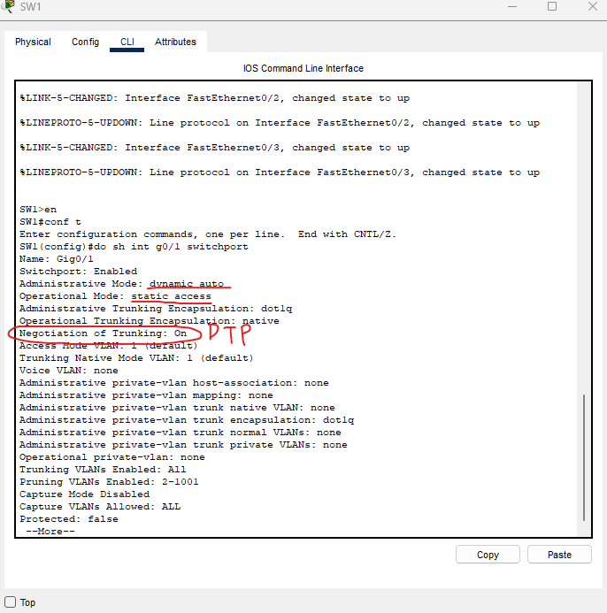

We can see that by default, SW1 is in dynamic auto mode.

'Negotiation of Trunking: On' lets us know that DTP is on. We must disable it.

Since all of the switches are defaulted to dynamic auto mode, they all will be in 'switchport mode access' (static access mode). 

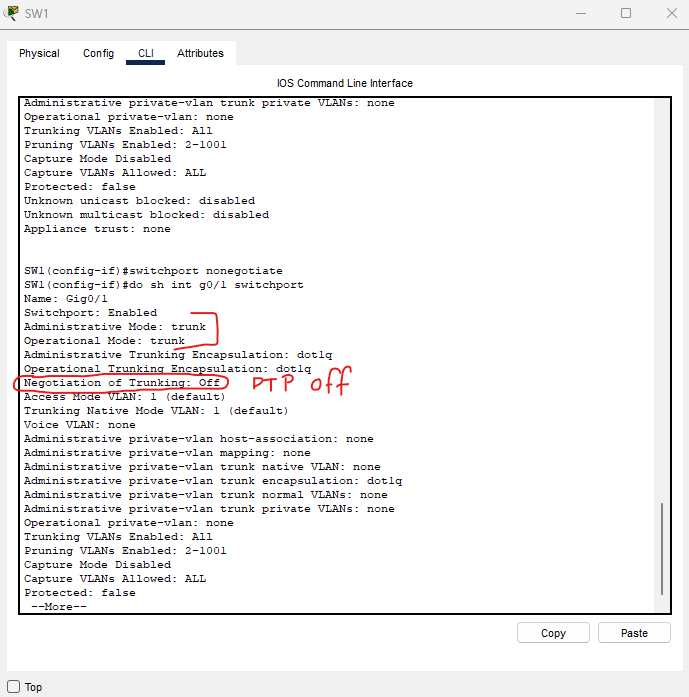

Using these commands:

- switchport mode trunk
- switchport nonegotiate

while in the interface of g0/1, we configure this interface to be in 'trunk' mode and disable DTP.

### We do the same for SW2 and SW3 by running the same commands on the interfaces we want to configure

And with that, step 1 is complete.

### Step 2: Configure SW1 in VTP domain CCNA

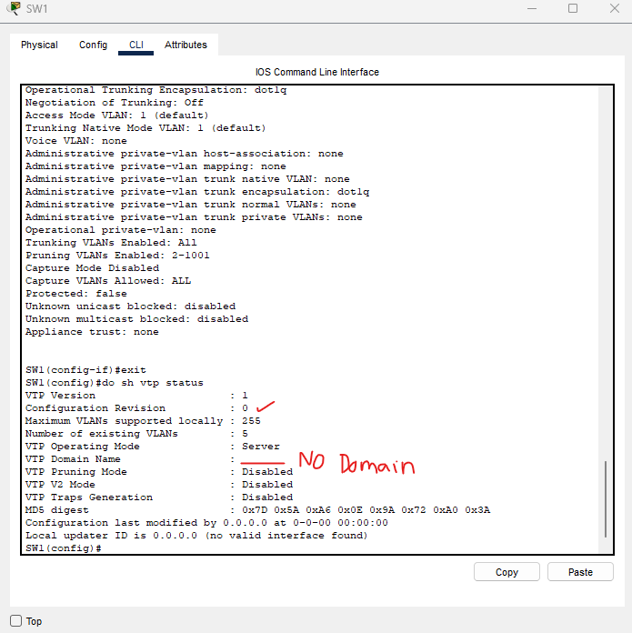

The first look of SW1's VTP situation with the command 'do show vtp status' shows us VTP info:

- No domain name
- Revision number of 0
- VTP Version 1 (since V2 is disabled)

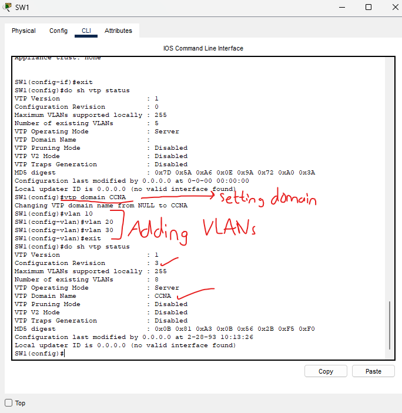

With this, SW1 is now configured.

We haven't done any VTP configurations on SW2 and SW3, but they should receive the VTP advertisements from SW1.

This is because they have domain NULL (no domain). Any VTP server/client with no domain will automatically accept VTP advertisements.

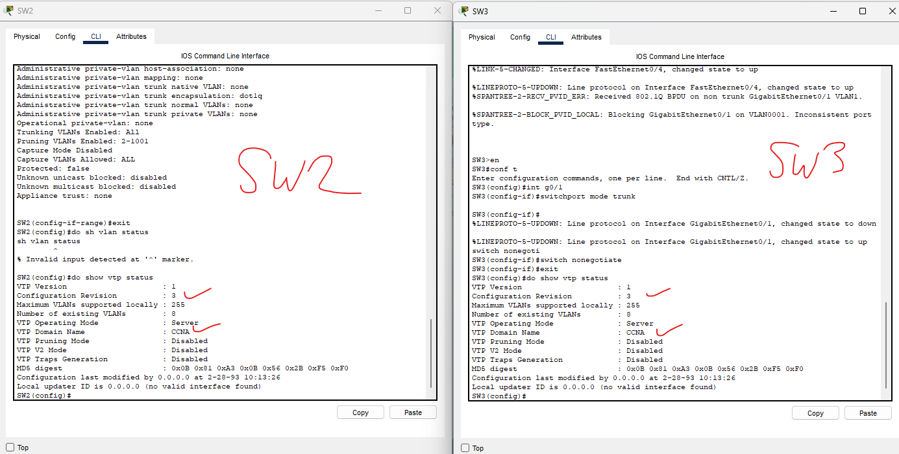

This confirms our theory.

### Step 3: Configure SW2 as transparent mode and add VLAN40

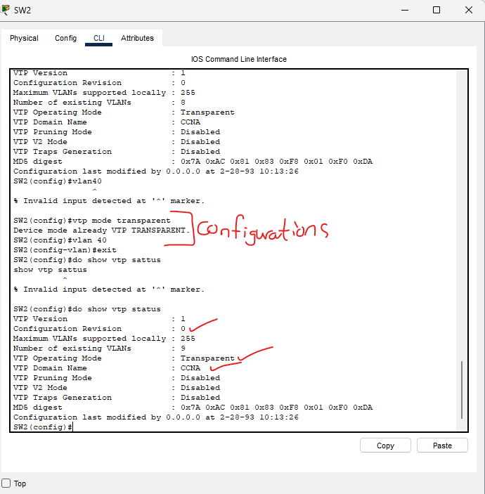

Configuring SW2 to transparent mode resets the revision number back down to 0. Since we added VLAN40 to switch 2, we know that in transparent mode it will NOT advertise it to the other switches.

Though, because SW2 is in the same domain, it will still forward advertisements between SW1 and SW3

### Step 4: Configure SW3 as client mode and try add VLAN50
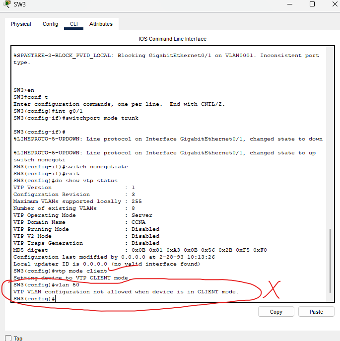

We can see that in client mode, you are not allowed to add/modify/delete VLANs as shown in the screenshot.

If we want to add new VLANs on SW3, we must create them on SW1 which will then advertise it to SW3 and sync its VLAN database.

### Step 5: Configure all switchports as access ports

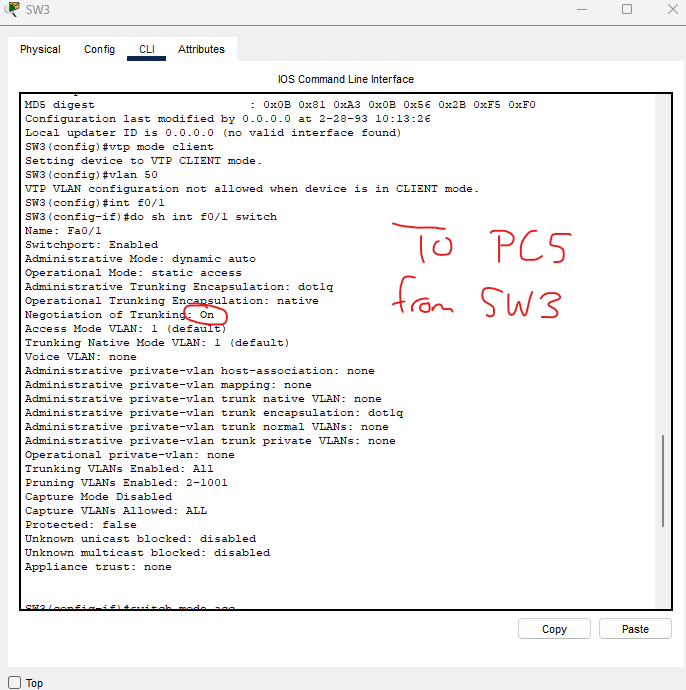

We can see that DTP is enabled on the interface from SW3 to PC5 (f0/1). Let's test if putting it in access mode will disable DTP.

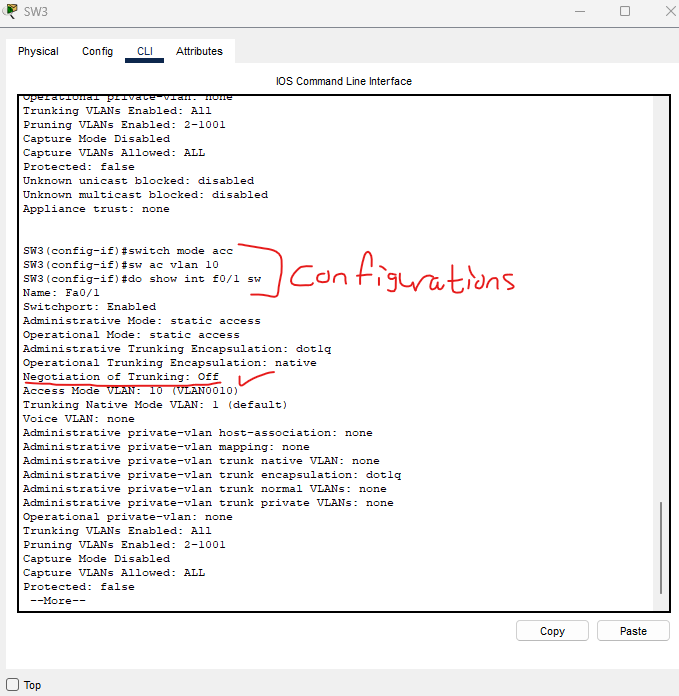

And this confirms, putting the interface in access mode will disable DTP.

We can now run through the rest of the configuration and change all other interfaces to switchport mode access.

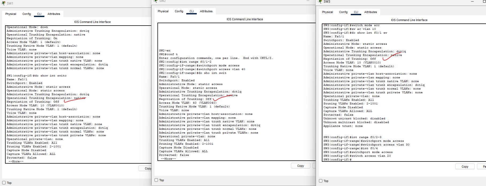

And finally, a screenshot showing an interface from each switch that shows DTP is disabled on all interfaces.

This lab is now complete.

