### Lab overview

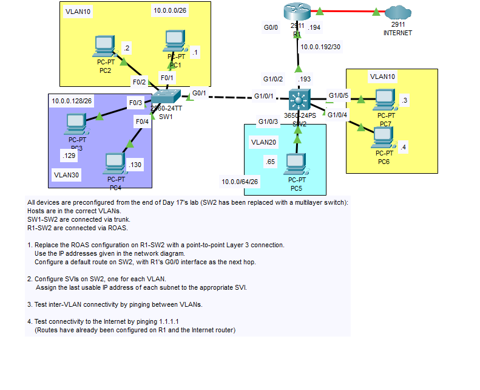

### Step 1: Replace ROAS Configuration with p2p layer 3 connection

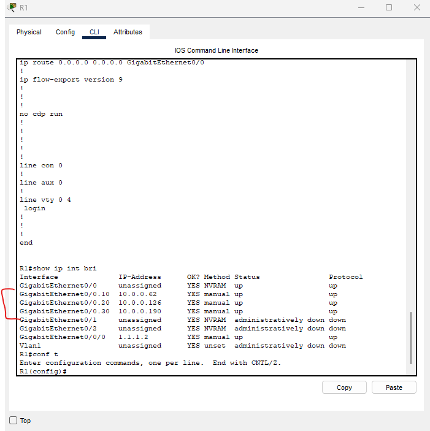

We can see our ROAS configuration with the subinterfaces on R1 as marked in the screenshot. We will begin by removing them.

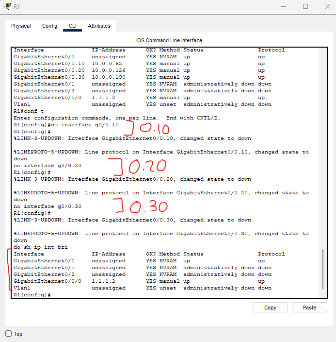

Using the 'no' command before the interface, we have deleted the three subinterfaces:
- G0/0.10
- G0/0.20
- G0/0.30

### Assigning an IP Address to R1's G0/0 interface

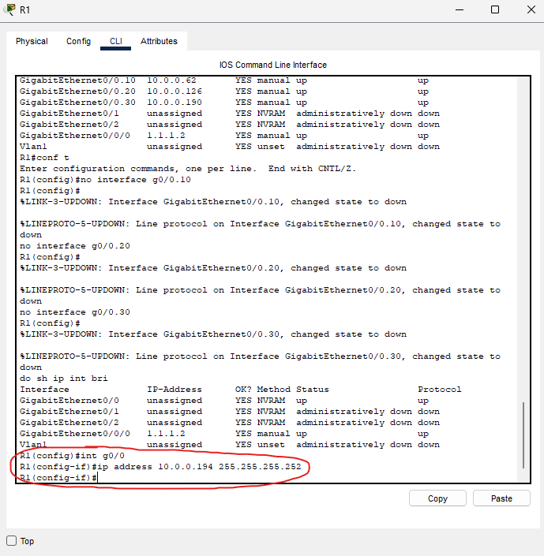

### Configuring SW2

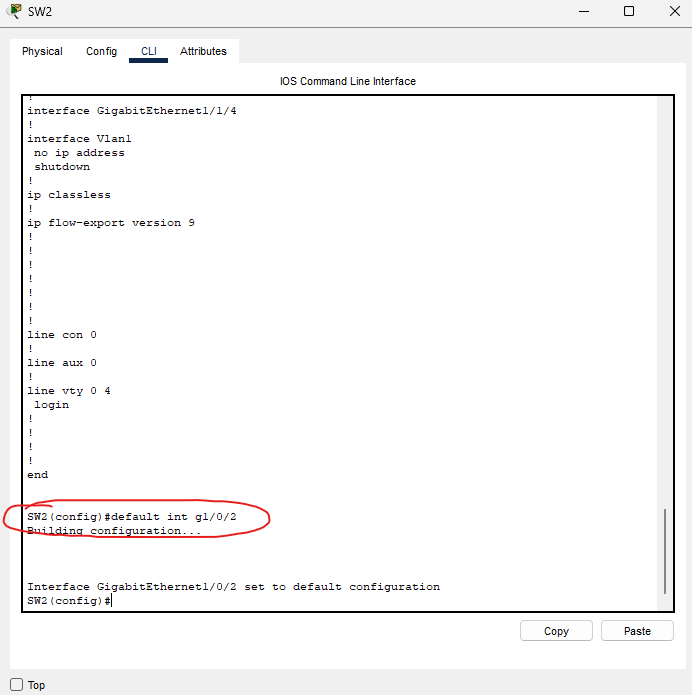

We can return SW2's G1/0/2 interface to default settings running the 'default interface g1/0/2' command. From there, we can continue working...

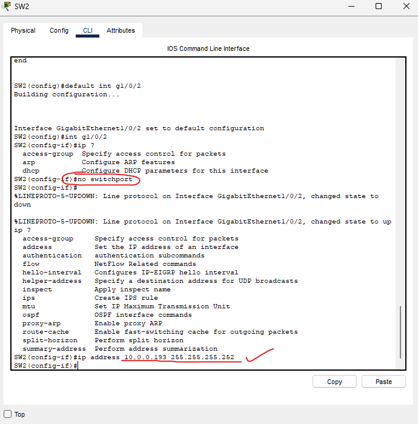

Upon using the '?' feature after the word 'ip', we can see that the switch is in layer 2 mode still.

Running the 'no switchport' command allows the switch to act as a layer 3 device.

Running the '?' feature again after the word 'ip' shows many more options that we can now work with.

We finally set the IP address of the G1/0/2 interface.

### Setting SW2's default route.

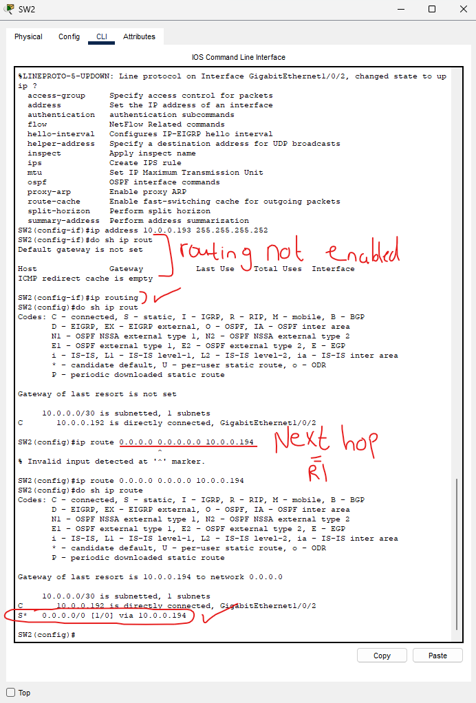

Upon an initial view of the routing table for SW2, we see that there are no routes. This is because routing is not yet enabled on the switch. We enable it with the 'ip routing' command.

Now that we have routing enabled, we can set the default route:

- '0.0.0.0 0.0.0.0 10.0.0.194' 

With 10.0.0.194 just being the address of the next hop (to R1)

### SVI (Switched Virtual Interface) Configurations

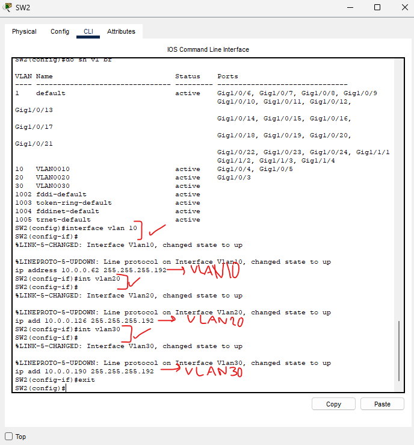

For an SVI to be in the up/up state, we must ensure that the VLAN's actually exist.

Running the 'interface vlan [number]' command will take us into the VLAN interface or create the VLAN interface if it does not yet exist.

In each VLAN interface, we want to assign the LAST usable address as this multilayer switch is acting as our default gateway.

We do this so that the SW2 can do inter-vlan routing instead of the router. This improves network performance as we don't have to route all inter-vlan traffic through the router anymore.

### Confirming SVI is up/up

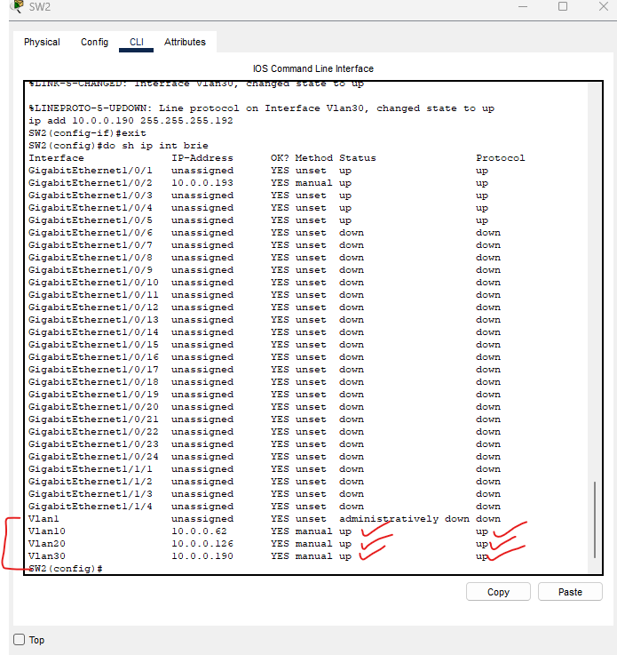

We can see that the VLAN 10,20,30 SVI's are all up/up!

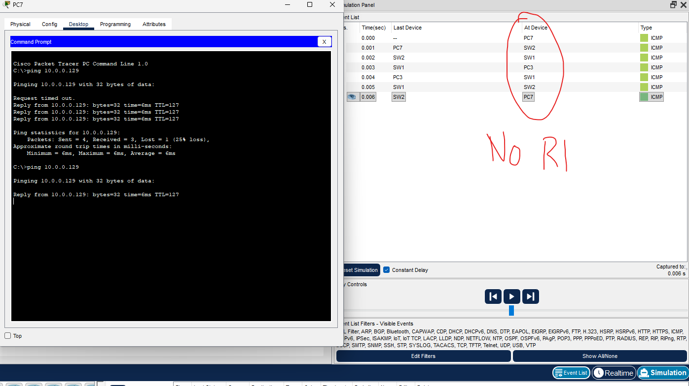

And to confirm we have the proper connectivity, I ping PC3 from PC7 (VLAN10 to VLAN30) and the multilayer switch handles inter-vlan traffic within its own software!

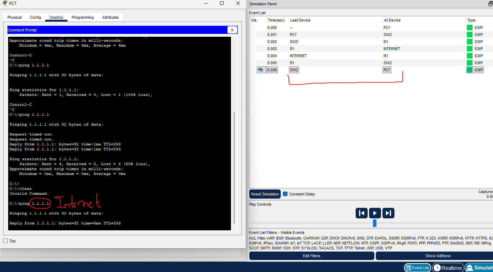

Finally, we can test the default route by pinging the internet (1.1.1.1) and confirm that we have full network connectivity! 

This lab is now complete.
