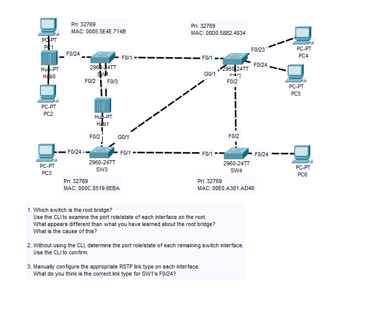
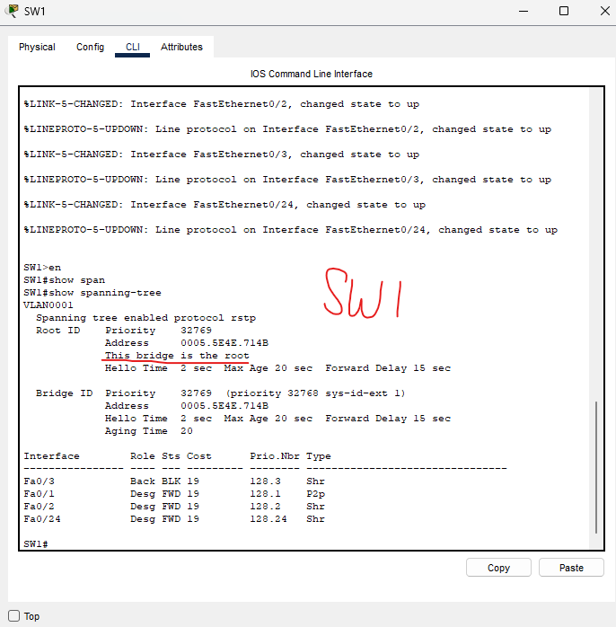
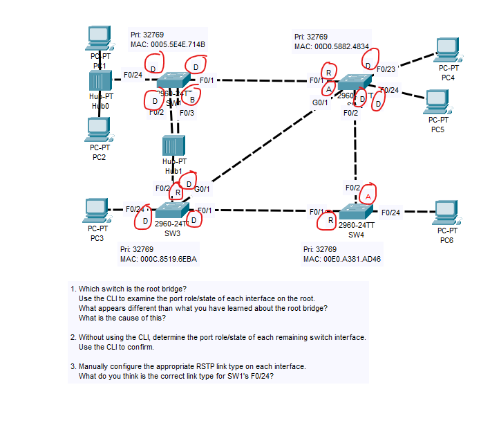
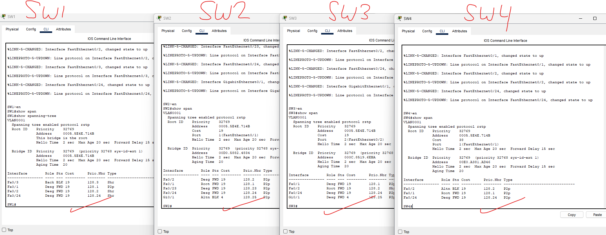
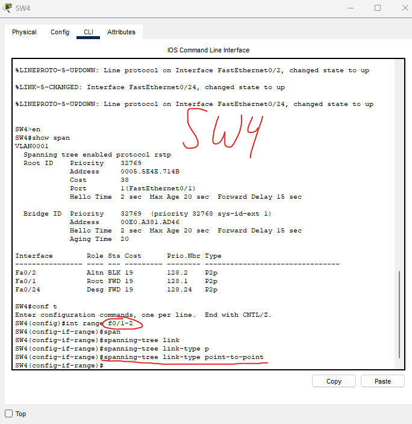
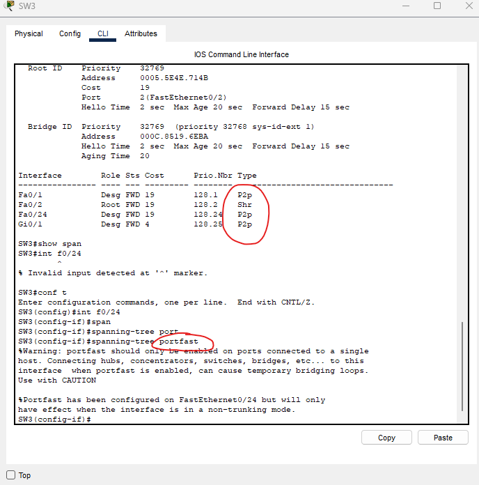
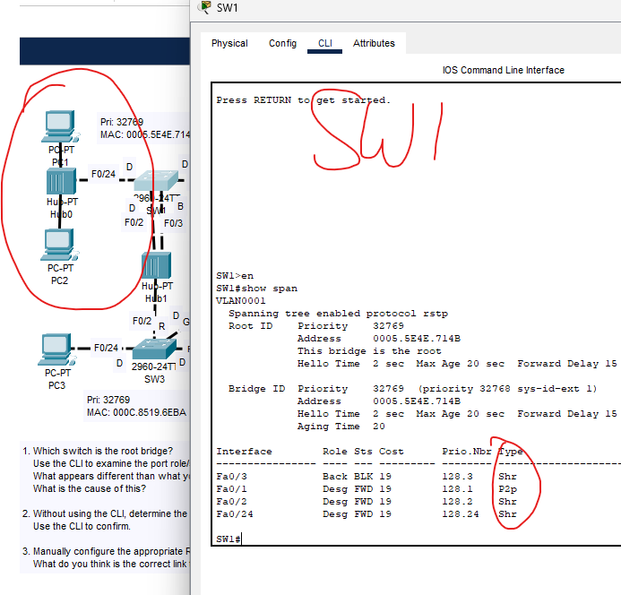
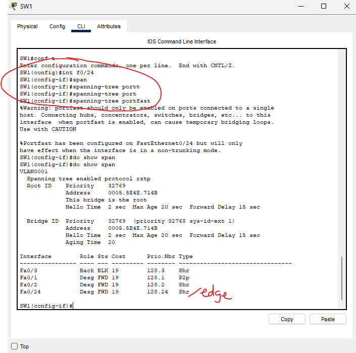

### Lab overview

These are all in VLAN1. We can tell by all of their priority's being 32768 + 1 = 32769.

All the switches have the same priority, so we will have to compare MAC addresses.

Upon comparing MAC addresses, we can find that SW1 has the lowest MAC address, making it the root bridge.

Verifying through the CLI, we see our assumption is correct.

### Determine the port role/state of each remaining switch interface without using the CLI

Here is my take on the port role/state of each remaining switch interface.

Let's verify it using the CLI.

And there we have it, all information is correct upon comparing the CLI to my take.

### Manually configure the appropriate RSTP link type on each interface

The three link-types are:
- Point-to-Point (Switch connected to another switch)
- Shared (When a hub is present)
- Edge (To end hosts)

We'll start with SW4. It only has two connections to two other switches, making it a really easy config. This one is a point-to-point connection.

### Switch 3

Here we can see the switch already automatically assigned the correct link-types. All we will do is manually configure portfast onto the connection that is connected to end-hosts.

### (I do the same for Switch 2's ports connected to end hosts)

### Moving on to SW1, there is an interesting connection here.

We can see that all the ports that are connected to a hub are shared ports, while the only port connected to another switch is in point-to-point connection.

Now, F0/24 is connected to a hub, but there are endhosts connected to the hub. This should be an edge port. The hub basically doesn't exist in terms of spanning-tree.

F0/24 is an edge port AND a shared port.

Let's configure it.

And here we can see that I enabled portfast on that interface. It should show Shared/Edge for the type, but Cisco Packet Tracer isn't!

This lab is now complete.
