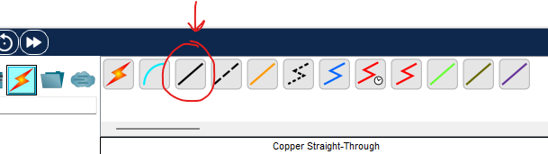
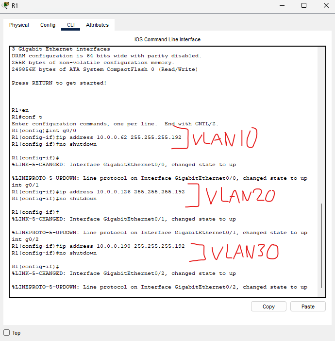

### Lab Overview

### First step: PC Configuration
We will configure
- IP address
- Subnet mask
- Default Gateway

### IP Addresses / Subnet Masks

### Default Gateways

With that, step 1 is complete.

### Second step: Making connections

We are going to use a copper straight-through cable to connect SW1 to R1. These are physical connections and will be done through interfaces on both R1 and SW1.

We have made 3 connections as seen by the 3 black lines from SW1 to R1.

Now we configure R1 in the CLI:

- G0/0 for VLAN10
- G0/1 for VLAN20
- G0/2 for VLAN30

We must be sure to assign the same IP address that we configured as the gateway address on PC from each VLAN so:

For VLAN10:
- 10.0.0.62

For VLAN20:
- 10.0.0.126

For VLAN30:
- 10.0.0.190

### Confirmation

And as we can see after running the 'do show ip interface brief' command, our interfaces are properly configured.

With that, step 2 is complete.

### Third step: Configuring SW1's interfaces

Each VLANs interfaces on the switch:

VLAN10:
- g0/1 (to r1), f3/1 (to pc1), f4/1 (to pc2)

VLAN20:
- g1/1 (to r1), f5/1 (to pc3), f6/1 (to pc4)

VLAN30:
- g2/1 (to r1), f7/1 (to pc5), f8/1 (to pc6)

### We can rename each VLAN now

Renamed each VLAN to match their description for extra readability.

With that, step 3 is complete.

### Final step: Testing connectivity

We can see that we have connectivity, let's check it out in simulation mode now.

R1 is doing all of our inter-VLAN routing because it has one interface in each VLAN.

### Let's ping VLAN10's broadcast IP and see what happens.

Looking at the flow we get:

- PC1-SW1
- SW1-R1
- SW1-PC2

As expected, the switch flooded the broadcast frame out of all of its interfaces and kept it within our VLAN!

This lab is now complete.

