### Lab overview

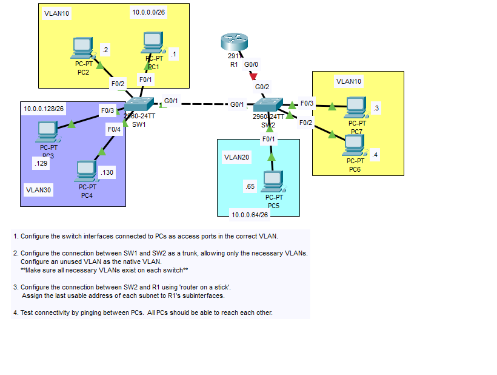

### Step 1: Configure switch interfaces

### SW1 Configuration
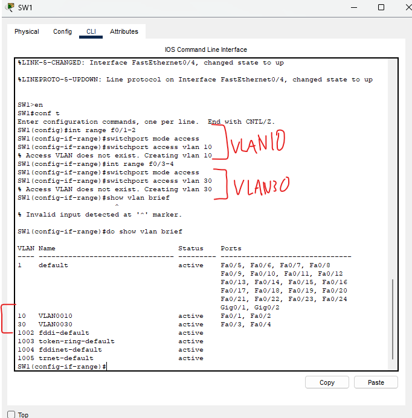

### Sw2 Configuration
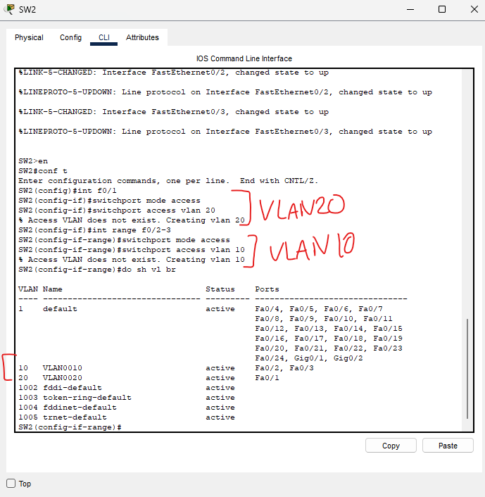

With this, we have configured the switch interfaces connected to PCs as access ports in their correct VLANs

### Step 2: Configure the connection between SW1 and SW2 as a trunk

### Configuring SW1's VLANs as a trunk (and native VLAN)

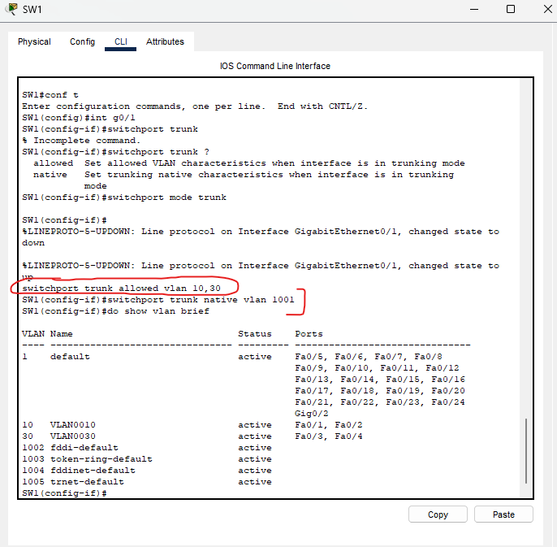

For the native VLAN, you can use any unused VLAN, so we went with 1001.

When using the 'switch trunk allowed vlan 10,30' command, we have to ensure that all the vlans we allow actually exist. If they don't exist, this command will NOT create them for us as the 'switchport access vlan 10' command does.

With confirmation from the 'do show vlan brief' command, we can see that we do not need to create any more VLANs as they are all already on our network.

### Moving on to SW2

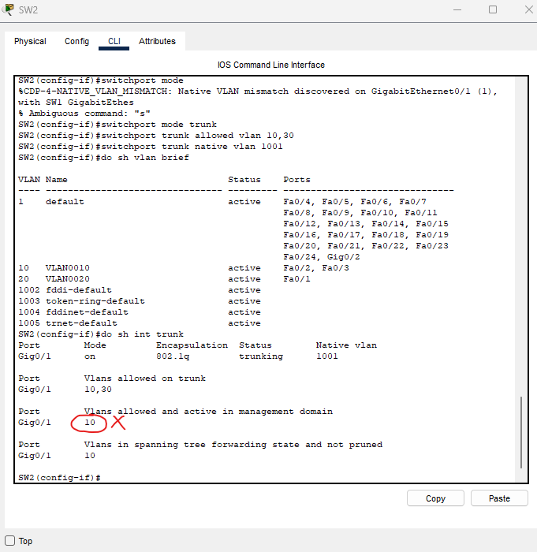

Looking at this, we have allowed vlans 10,30 on this switch in trunk mode.

We check using the 'do sh vlan brief' and 'do sh interface trunk'

There is a problem!

**VLAN10 is the only VLAN allowed and active in this management domain**

This means SW2 won't actually receive VLAN30 traffic on this trunk.

VLAN10 and 20 were created when we made access ports on SW2, however, VLAN30 was never created.

So... Let's do it!

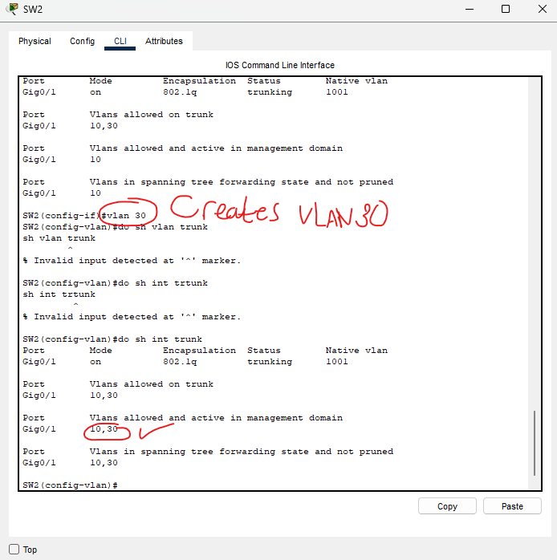

Now VLAN10,30 are both allowed and active in the management domain. SW2 is now able to receive all VLAN traffic.

### Configuring SW2 G0/2 interface (Toward R1)

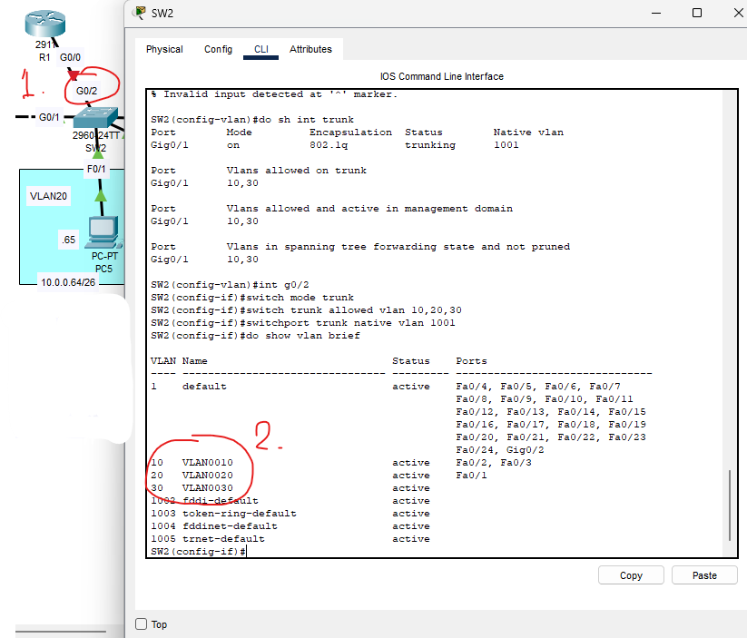

In our introduction lab to VLANs, we had to make a physical connection for each VLAN on the interfaces of the switch and the router. 

Here, we can use one physical connection and logically separate each VLAN in the Cisco IOS CLI!

### Moving on to configuring R1's subinterfaces

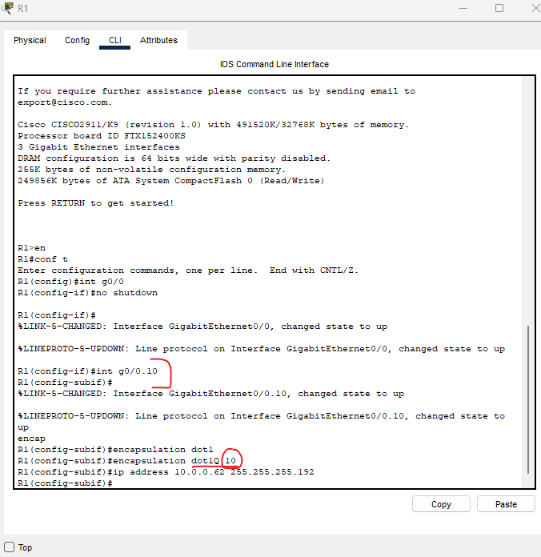

The subinterface number (g0/0.10) does NOT have to match the VLAN number, but it makes it much more readable and is best practice.

**'encapsulate dot1Q 10'**:
- When a frame is sent to the router, it will look at the destination IP of the frame and determine which VLAN it is in and tag the frame that it will then send over a trunk link.

- As an example, if the destination IP of a frame is 10.0.0.1, it will recognize that as being in VLAN10 and it will add the 802.1Q tag to the Ethernet Frame Header. In this tag, the VID (VLAN ID) will be set to the VLAN the frame belongs to.

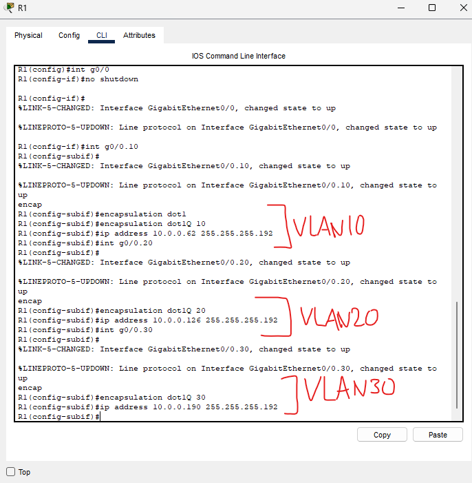

This completes our configurations for R1, we have VLAN tagging enabled for all 3 VLANs, ensuring connectivity.

My system for assigning default gateways for each VLAN involves assigning the LAST usable address in each VLAN, it ensures standard addressing scheme to be used throughout the network.

### Testing connectivity

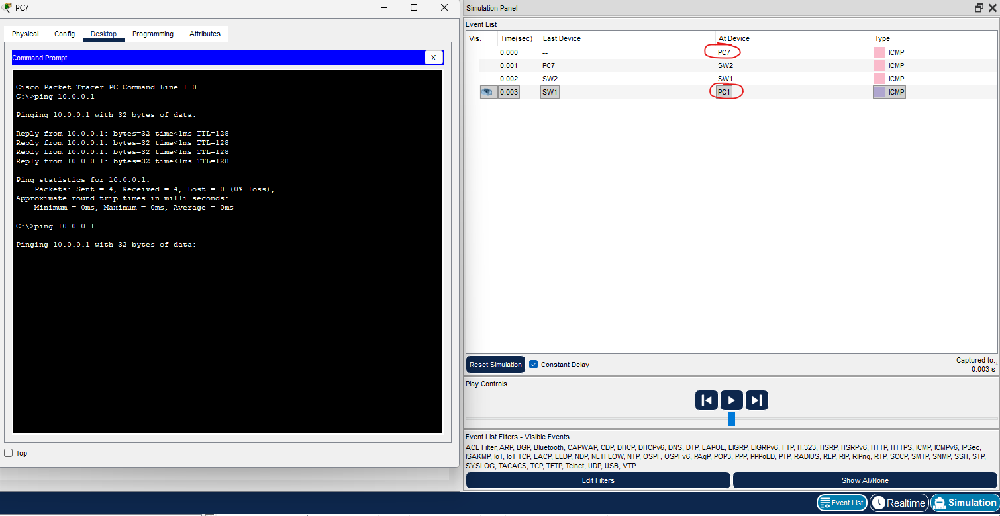

We can see we instantly get connectivity pinging PC1 from PC7. We don't have to go through R1 to get to PC1 because PC1 and PC7 are in the same VLAN (VLAN10) even though they are a switch away from each other!

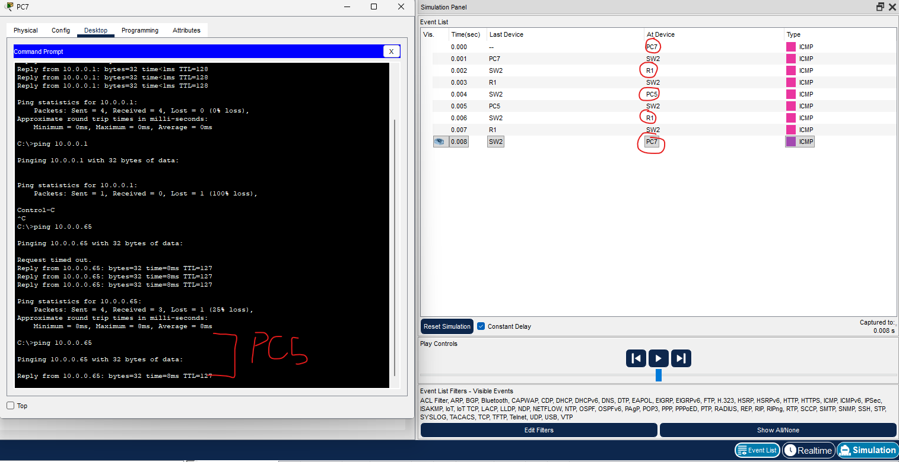

Here, it shows that if you are pinging a PC in a different VLAN (VLAN10 to VLAN20), the frame travels through R1, gets tagged, and travels to the correct VLAN.

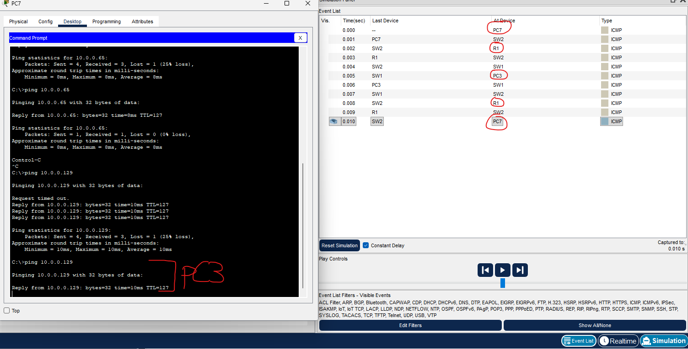

And finally, we can see that we can ping from VLAN10 to VLAN30 as well. Still, it must travel through R1, get tagged, and be on to its destination.

### Connectivity is verified across the network

This lab is now complete.
