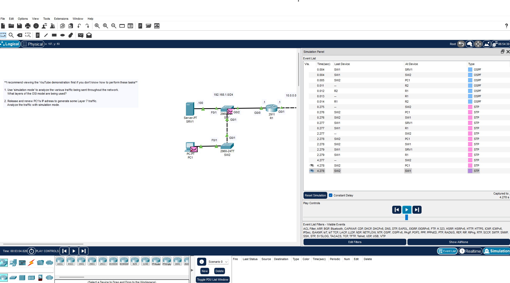
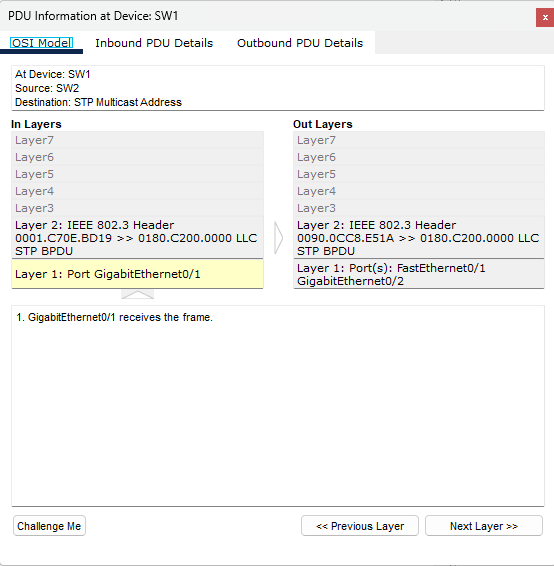
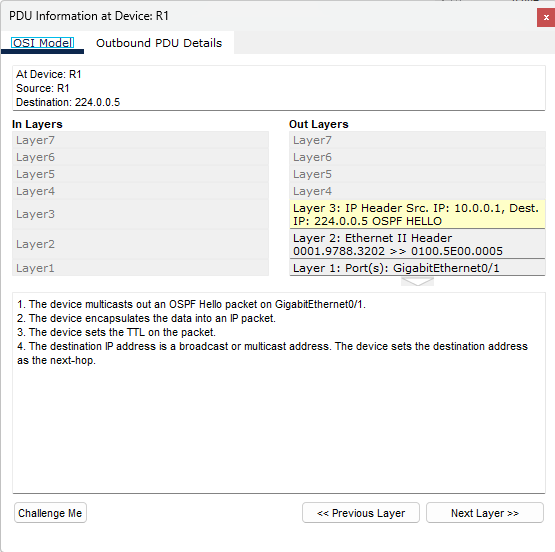

### General diagram and the simulation have been ran to show information

### Showcasing the switch operating at layers 1,2. Also running Spanning Tree Protocol.

### Router 1 with OSPF protocol. Layers 3,2,1. IP Addresses are layer 3 information.

