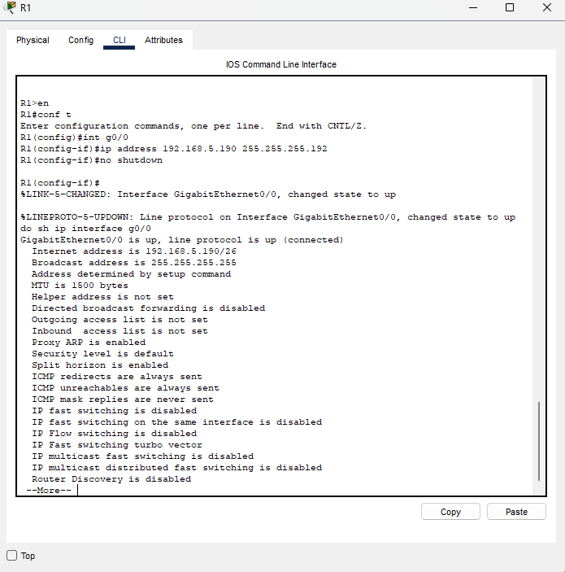

### Lab overview

When assigning VLSM subnets, we want to do it in order of largest to smallest... So our specific order for this lab will be:

- LAN2
- LAN1
- LAN3
- LAN4

Since we are going to use the /25 prefix, that gives us 126 usable addresses.

LAN2 Network Address:
- 192.168.5.0/25

LAN2 Broadcast Address:
- 192.168.5.127/25

### Let's assign the addresses to PC2 and R1 in LAN2

### R1 LAN2 Configuration

Everything looks correct, but what about the broadcast address?

R1 Broadcast address:
- 255.255.255.255

This address functions the same as the subnet broadcast address of 192.168.5.127/25. It can be used for any network.

If a host sends a broadcast to 255.255.255.255, it won't be sent to all networks, it will stay in the local subnet.

The subnet broadcast address however, 192.168.5.127 can be used by hosts in other subnets to send broadcasts in this subnet.

### PC1 LAN2 Configuration

We set the IP to the first usable address, then we want to be mindful of the subnet mask. 

It automatically configures to 255.255.255.0 when we put the IP address, it must be changed to match the prefix length of /25 for the subnet (in this case 255.255.255.128)

This completes LAN2's configuration.

### LAN1

Since we are going to use the /26 prefix, that gives us 62 usable addresses.

LAN1 Network Address:
- 192.168.5.128/26

LAN1 Broadcast Address:
- 192.168.5.191/26

### R1 LAN1 Configuration

Similar to before, everything looks correct.

### PC1 LAN1 Configuration

For the /26 prefix, the subnet mask will be 255.255.255.192 (2 borrowed bits, being 128, 64) 128+64 = 192.

### For LAN3 and 4, we continue the same cycle

For LAN3 we use the /28 prefix, 2^4 - 2 = 14 usable addresses

LAN3 Network Address:
- 192.168.5.192/28

LAN3 Broadcast Address:
- 192.168.5.207/28

### LAN4

For LAN4 we use the /28 prefix, 2^4 - 2 = 14 usable addresses

LAN4 Network Address:
- 192.168.5.208/28

LAN4 Broadcast Address:
- 192.168.5.223/28

### Now let's deal with the connection between R1 and R2

Both /30 and /31 are fine to use. Seeing as this is a point-to-point connection, we only need a network and broadcast address (meaning we don't necessarily 'need' any usable addresses).

Though, the safe option is to use the one with some padding... /30. That gives us a bit of room to work with.

### R1 Configuration

### R2 Configuration

### Now, the last step is configuring the static routes on each router.

### R2 Static route configuration

### R1 Static route configuration

### Now we can test our static routes with a ping

The initial few pings will fail due to the ARP process not being completed yet, but as soon as it does, we can see that PC1 can now reach PC4.

We have successfully subnetted and configured a network, and then configured static routes to provide reachability.

This lab is now complete.

