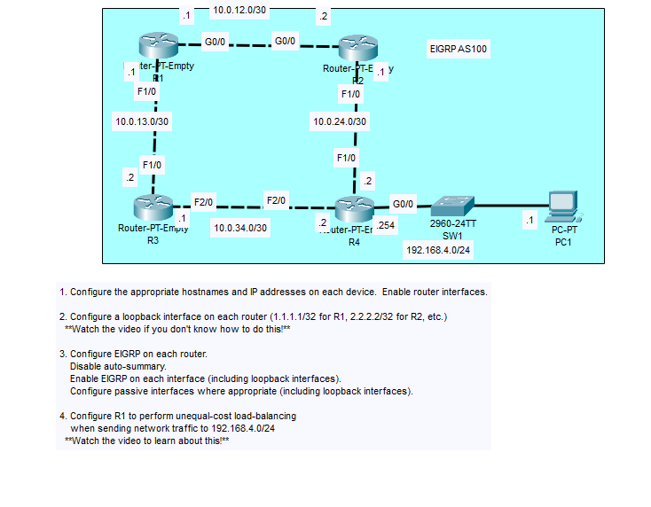
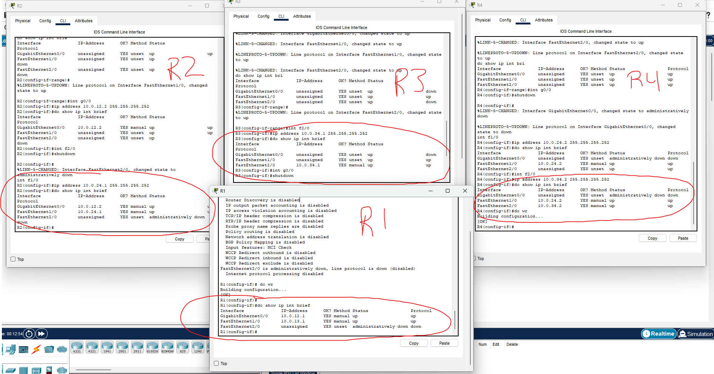
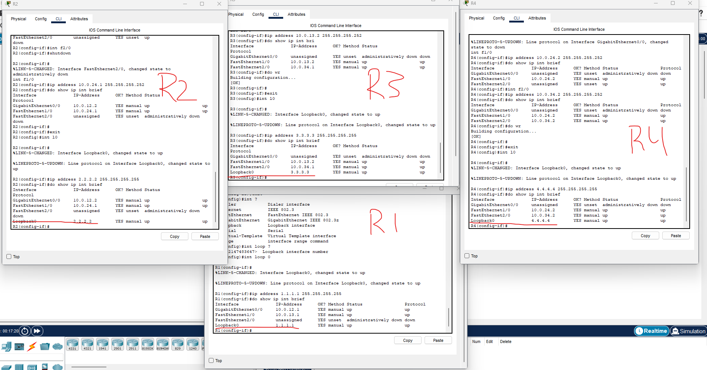
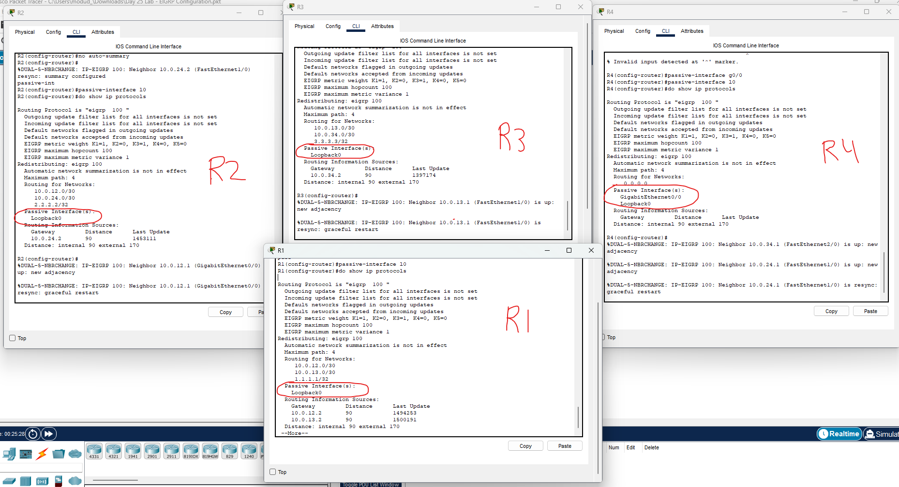
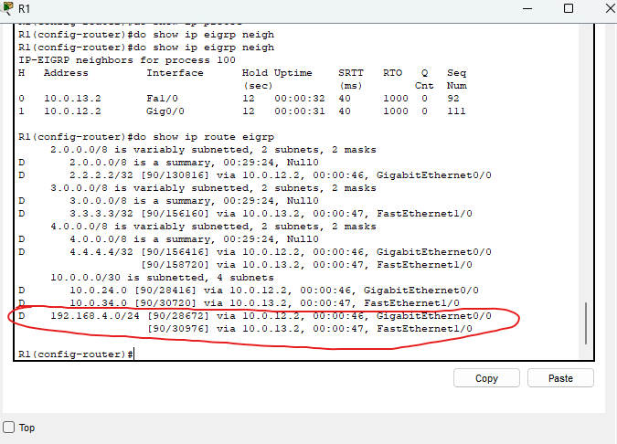

### Lab overview

### The first step is to practice our basics by setting up each router and its interfaces

Each router was completely defaulted, so we went through, enabled all needed interfaces and assigned them IP addresses with their proper subnets.

### For step two, we configure a loopback interface on each router.

We configure each loopback interface on loopback 0, to have extra readability, we use the same number as the router number for the 4 octet binary IP (ie: 1.1.1.1 for R1).

All are done with a /32 subnet mask.

### For step 3, we are to configure EIGRP on each router.

We will do this using the network command, though not recommended in real-world scenarios as to be more precise with the interfaces you enable EIGRP on, this will enable EIGRP on every interface.

We can see that on the R4 configuration, I use the network command to configure every single interface on the router with EIGRP.

On the other routers, we are more responsible in the sense that we are being more accurate with which interfaces we configure with EIGRP.

We are also sure to configure interfaces we are NOT using as passive interfaces so that we don't have any waste of resources on the router. (Always loopback interfaces).

It is also incredibly important to note that when configuring EIGRP on interfaces with the 'network' command, the mask portion is WILDCARD mask. This is an inverted subnet mask and should be taken into account as to not make any layer 8 errors.

### Step 4, configuring R1 to perform unequal-cost load-balancing

Okay so from what we know, the successor is the best route to a network. In the case of R1, the route via R2 is the best route due to its feasible distance.

The feasible successor is an alternate route to the destination which meets the feasibility condition.

The feasibility condition is when a feasible successor's reported distance is lower than the successor route's feasible distance.

The feasible distance is the route's metric value to the route's destination.

That was a lot!

Here we can see that I have configured EIGRP on R1 to have a variance of 2. 

This means anything that is less than 2x the metric value of the successor's feasibility distance will be added as a route that will do load-balancing.

If I didn't configure the variance, it would remain at 1x and would be doing ECMP (Equal Cost Multi Path) load-balancing. This would keep the route via R3 as an alternate route and not a load-balancing route.

This lab is now complete.

