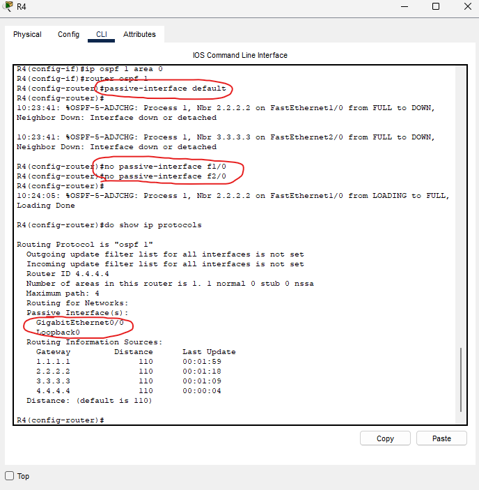

### Lab Overview

### Step 1 and 2 are simple, quick and just getting some repition in

I went ahead and configured all IPs across the network. I also configured loopback interfaces for each of the routers.

I also had to set the IP address, mask, and default gateway to the PC on the network. I did that statically.

### Configuring OSPF directly on each interface of the routers

Here, I configured OSPF on the specific interfaces that I needed to, rather than just configuring OSPF on the entire device.

The interfaces we needed to configure OSPF on for R1 were:
- F1/0
- G0/0
- Loopback 0

After configuring OSPF on these interfaces, we can make the loopback 0 a passive interface.

I ran the same kinds of configurations on all other devices.

### Configuring R4's interfaces with OSPF

I went ahead and configured OSPF on all of R4's interfaces, after configuring OSPF, I ran the 'passive-interface default' command. This makes every interface on the router a passive interface.

Then, by using the 'no' command, I can make all the interfaces that I don't want to be passive, active!

### Configuring reference bandwidth on each router so FastEthernet has a cost of 100

The formula for calculating OSPF cost is:
- reference bandwidth / interface bandwidth = cost

To achieve a cost of 100 on a FastEthernet connection, we have to adjust the reference bandwidth.

By default, the reference bandwidth is set to 100.

FastEthernet's speed is 100.

Therefore, by default, FastEthernet's cost is 1.

By adjusting the reference bandwidth using the 'auto-cost reference-bandwidth 10000'

We change the reference bandwidth to 10000, achieving our goal:
- Reference bandwidth (10000) / interface bandwidth (100) = cost (100)

### We must ensure to adjust the reference bandwidth on every device to be the same, else we will experience issues with OSPF

### Step 5 is to configure R1 as an ASBR that advertises a default route into the OSPF domain

The 'default-information originate' command along with setting a default route will make this router an ASBR (Autonomous System Boundary Router).

Let's verify by checking R4 to see what its default route is.

There it is! Confirmed that our default route has been shared across the OSPF domain.

### Using simulation mode to look at OSPF Hello messages

Here we go into simulation mode to get a closer look at the hello messages being sent out from each router.

Upon initial inspection, we see that there are layer 3 packets addressed to IP 224.0.0.5. That is the multicast address used to reach all OSPF routers on the link. It is the IP address that OSPF routers send hello messages to.

Just a few things we see here in the inbound PDU details...

This is a hello packet from R1 to R3.

We see the router ID is 1.1.1.1, and that it has a type of 1. Type 1 is for OSPF hello messages.

That is all for this lab.

This lab is now complete.
