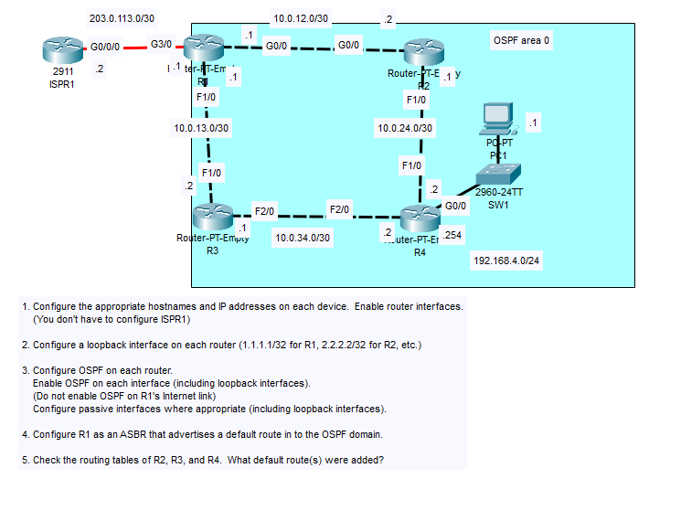
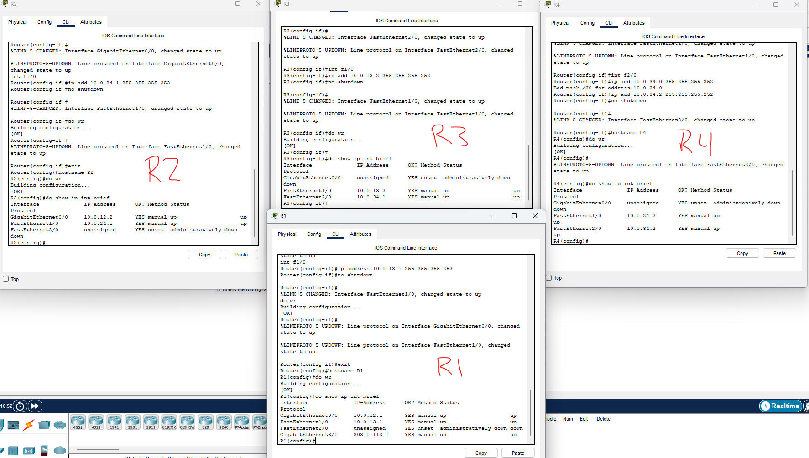
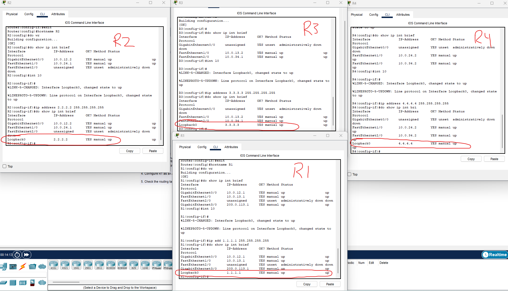
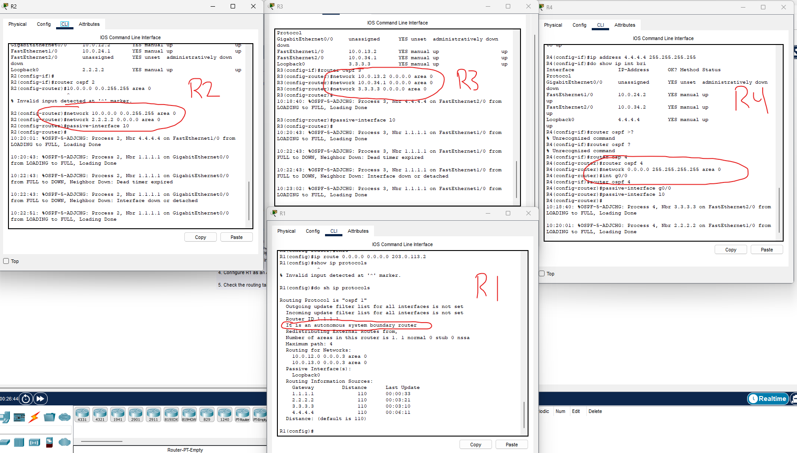
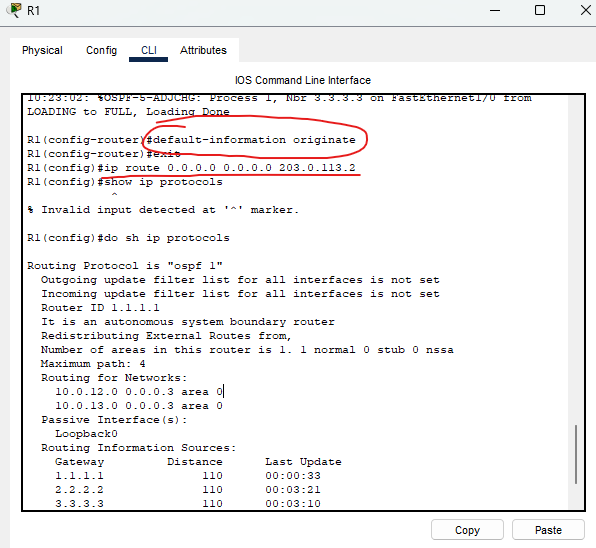
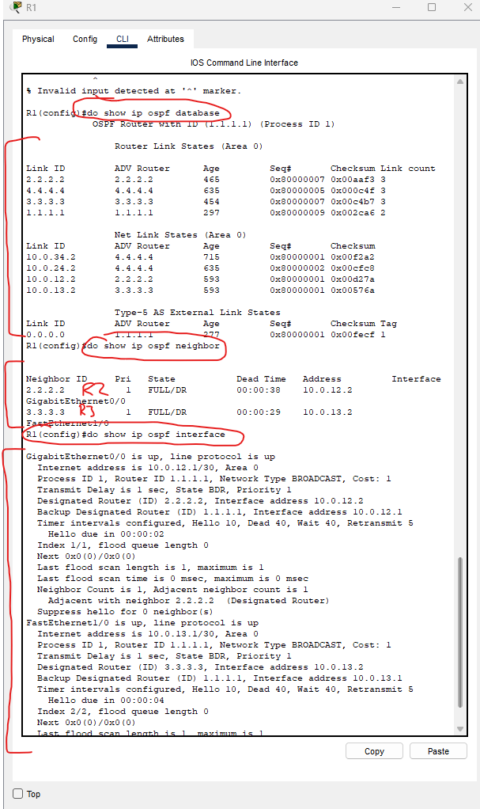
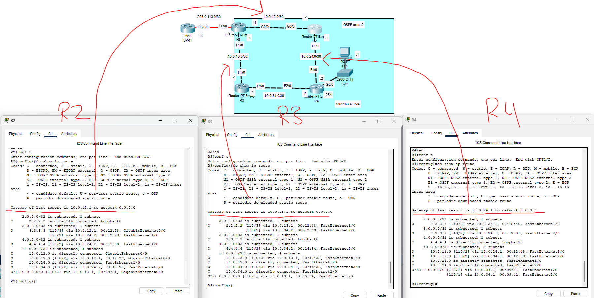

### Lab overview

### Step 1 is to configure appropriate hostnames and IP addresses on each device

There are our initial IP and hostname configurations.

### Step 2 is to configure a loopback interface on each router

A loopback interface is not a physical interface on the router, it is a virtual interface.

A benefit of this is that it can always be in an up/up state.

Here are our configured loopback interfaces on each router.

To create a loopback interface, we simply excecute the 'int l0' command, which creates a loopback0 on each interface. When we have this interface created, we just assign it an IP with a /32 mask and it is created and configured.

We configure OSPF on each router here.

We specify the network commands to configure OSPF using various methods to practice:

- On R4, we use a single command to enable OSPF on all interfaces

- On R3, we specify the exact address on each interface

- On R2, we enable the two physical interfaces with one command

- On R1, we configure the network address of each interface

We also configure each interface which isn't connected to an OSPF neighbor as a passive-interface.

Here, we also configured a default route to ISPR1. Then, by using the 'default-information originate' command, we give R1 the ASBR status (Autonomous System Boundary Router).

This is how we can advertise a default route to the entire OSPF area.

### OSPF show commands

Some of the show commands we use to inspect OSPF even further.

The **'show ip ospf database'** command will give us the entire network topology of the OSPF area. Each area has their own unique LSDB.

The **'show ip ospf neighbor'** command will tell us the active OSPF neighbors of the current device.

The **'show ip ospf interface'** command gives us details about the current OSPF settings on the interface.

### Step 5: Check the routing tables of R2, R3, and R4. What default routes were added?

At the bottom, we can see the O\*E2  route which is the default route that was attained through OSPF on each router.

We can also see that R4 has put both routes through R2 and R3 into its routing table. This means it will be load-balancing across both the connections even though the connection through R3 is slower than the connection through R2.

This is because it is load balanced because of the reference bandwidth, which is set to 100 Mbps by default.

We will work on solving that in the future.

This lab is now complete.

