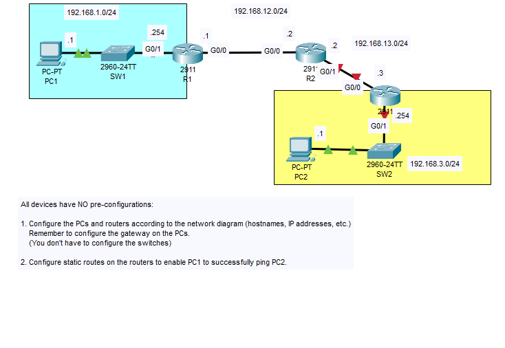
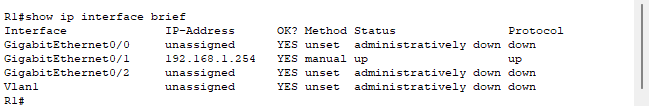
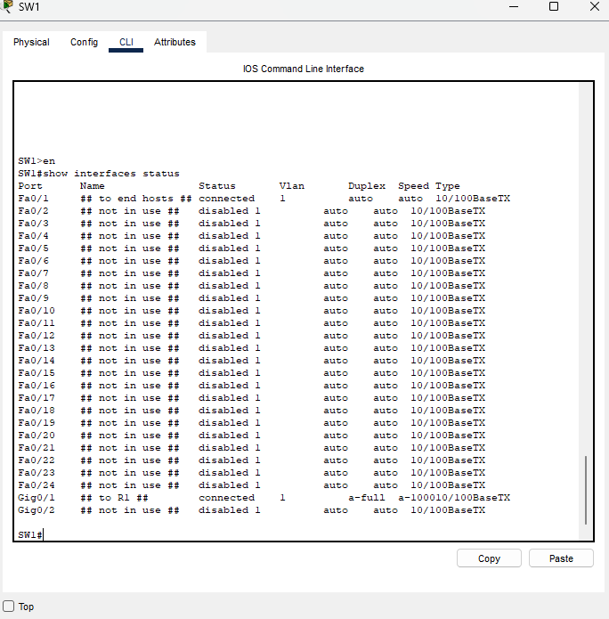
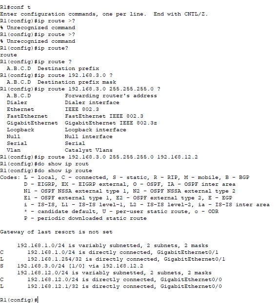
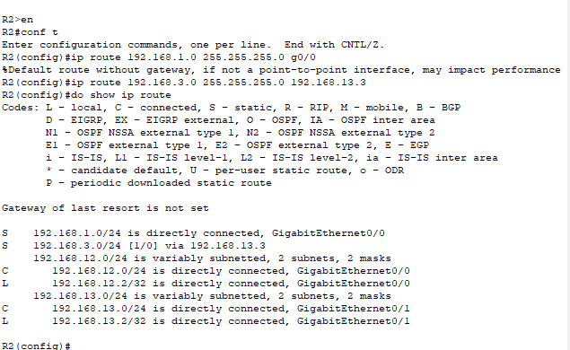
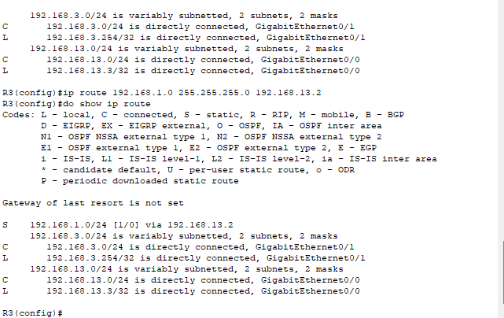
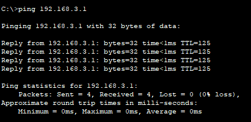

### Lab overview

### First thing is first, let's configure the switches and routers. (Hostname, IP addresses, descriptions, shutdown unused interfaces)

I will continue and do this for all other devices in the network.

### Before starting, we have to figure out what static routes we will have to configure for PC1's ping to reach PC2 and vice versa.

- Router 1 has a direct connection to the 192.168.1.0/24 network, so it needs a route to the 192.168.3.0/24 network.

- Router 2 has no direct connections to either network that the PCs are in, so it needs 2 routes. One to 192.168.1.0/24 and one to 192.168.3.0/24

- Router 3 has a direct connection to the 192.168.3.0/24 network, so it needs a route to the 192.168.1.0/24 network.

### In total, we will need to configure 4 static routes to achieve two-way reachability.

### Here, we configure R1s routing table with a static route toward PC2's network. We specify the next hop as R2's G0/0 interface's IP address.

As shown in the screenshot of R1's CLI, you can see the static route we configured denoted by the code "S" in the left side.

### Now we can configure R2 with both of the routes needed to both PC's networks.

I used both two different metrics here, next-hop and exit-interface. 
- For its route to PC1s network (192.168.1.0/24), I just said it can exit out of R2s interface G0/0.
- For its route to PC2s network (192.168.3.0/24), I gave it the next hop to R3's interface G0/0 IP address (192.168.13.3).

With this, R2 is now statically configured.

### And finally, a fully configured R3 with the route to PC1's network.

ip route (pc1's network and mask) and next-hop (192.168.13.2)

### We can now try to ping PC2 from PC1 and see if it works.

### Success!

This lab is now complete.
