### Lab overview

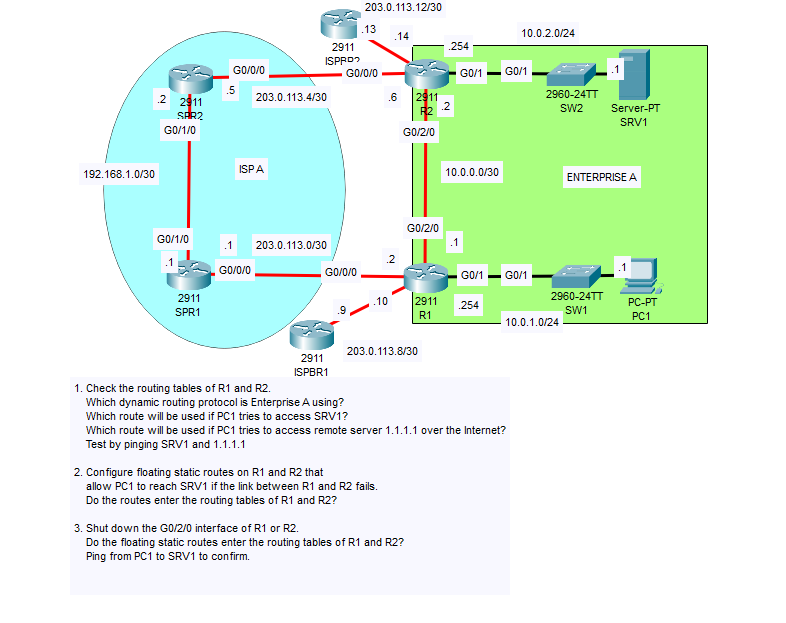

### The first step is to check the routing tables of R1 and R2

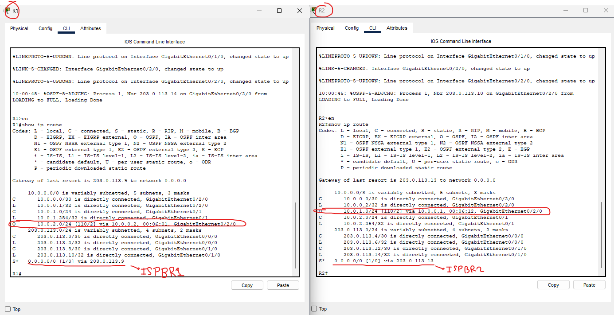

### FOR PC1 

**Which dynamic routing protocol is Enterprise A using?**
- Enterprise A is using OSPF (Open Shortest Path First), denoted by the 'O' in the routing table.

**Which route will be used if PC1 tries to access SRV1?**
- SRV1's IP address is 10.0.2.1/24, so it will select its most specific route, which happens to be 10.0.0.2 via its G0/2/0 interface (R1 to R2).

**Which route will be used if PC1 tries to access remote server 1.1.1.1 over the internet?**
-The server 1.1.1.1 is not in the network diagram, but it is somewhere on the internet. So it will use its default route 0.0.0.0/0 via 203.0.113.9.

### Testing ping from PC1 to SRV1 and 1.1.1.1

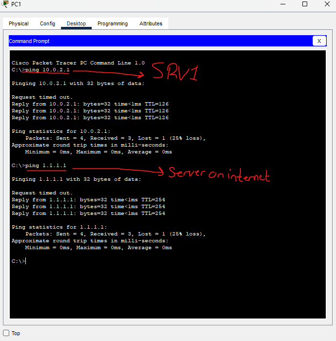

Looking a bit further with simulation mode, we can verify this route.

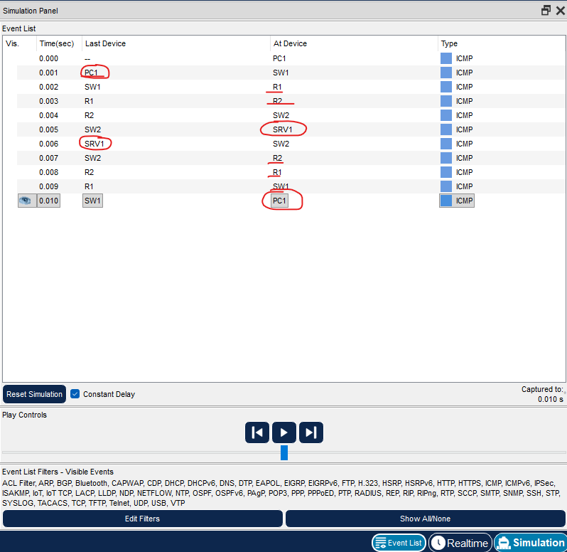

Tracing the path (not exact),

PC1 -> R1 -> R2 -> SRV1
SRV1 -> R2 -> R1 -> PC1

We never take the path through ISP A.

### Now let's ping 1.1.1.1 from PC1 in simulation mode

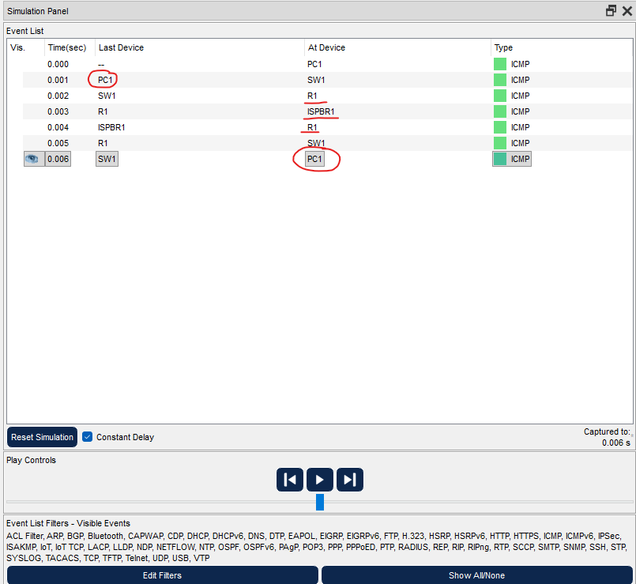

Since 1.1.1.1 does not exist on the network, the ping will take our least specific route (the default route). Which just so happens to be 203.0.113.9 (ISPBR1).

Our ping reaches ISPBR1, then is returned via ISPBR1 (assuming it reached the server and the server sent its ICMP Echo Reply)

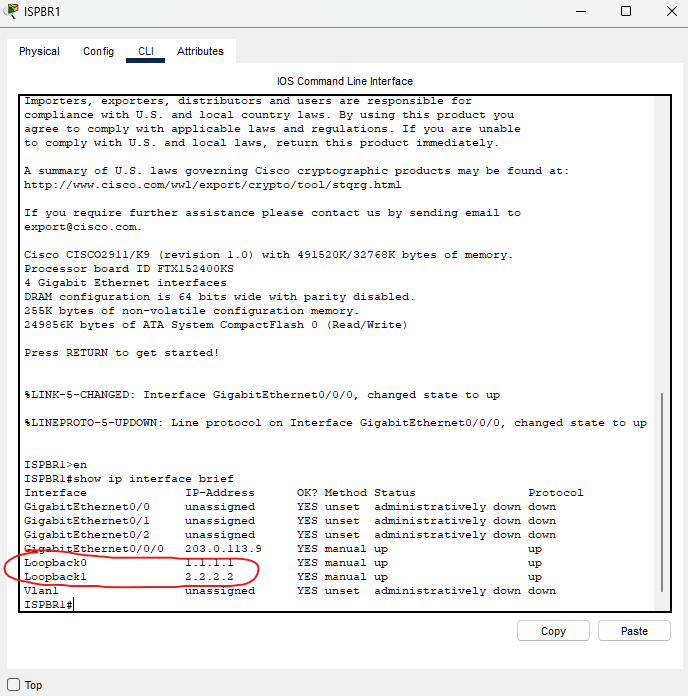

We can simulate the "internet" by using these loopback addresses on our ISPBR1. The remote "server" 1.1.1.1 isn't actually a server, it's just a virtual loopback address on ISPBR1.

### Configure floating satic routes on R1 and R2

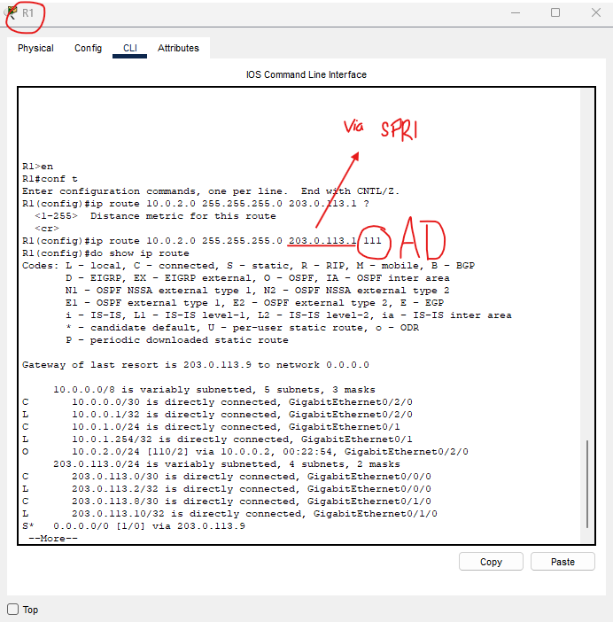

We configure a static route to SRV1's LAN through ISP A. This is done by routing the static route to SPR1's G0/0/0 interface. The administrative distance (AD) is set to 111 so that it is kept as a BACKUP. 

The router will select the route with the lowest AD as its routed path, since we just configured the static route with an AD of 111, it will NOT be selected over the OSPF route which has an AD of 110 (as seen in the picture).

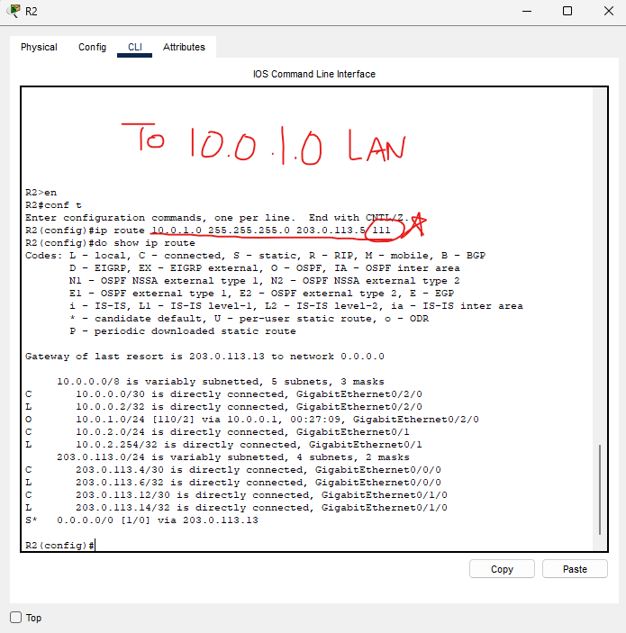

We do the same configuration on R2, we can see that the OSPF route is selected.

If we didn't change the AD of the static route, it would automatically be selected over OSPF because by default, static routes have an AD of 1.

### Let's shut down the connection between R1 and R2 and see if the routing table gets updated

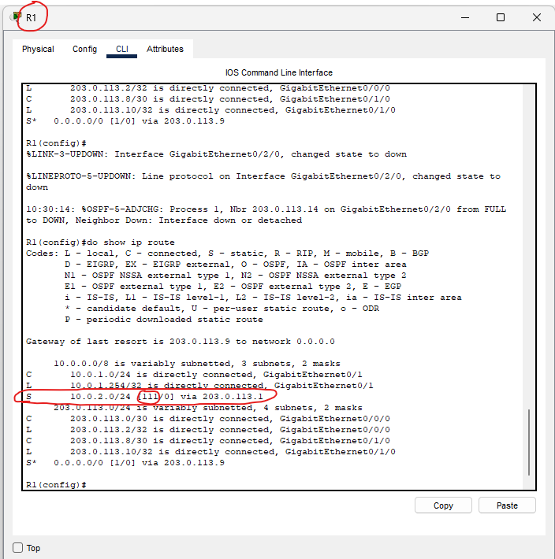

After shutting down the G0/2/0 interface on R2, we can see that R1 has updated its routing table.

There is no longer an OSPF route, it is now the static route we had configured with the AD of 111.

### Pinging PC1 to SRV1 with the new route

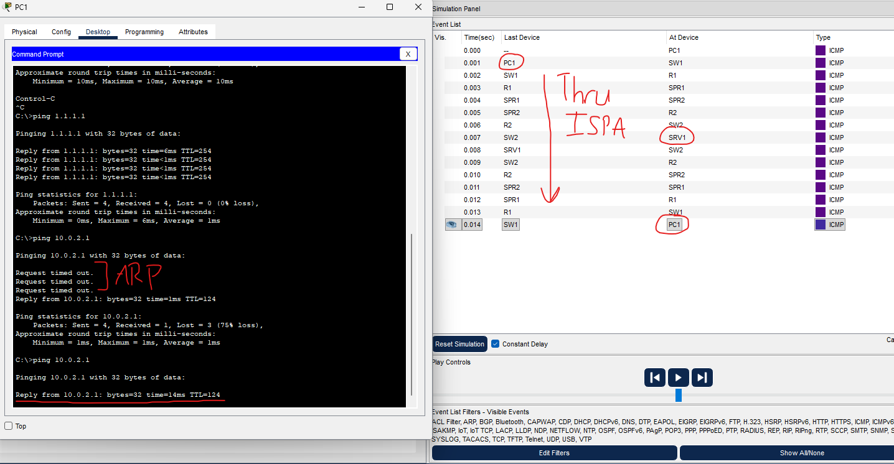

With simulation mode, we follow the packet through the network. We can see now that since the connection between R1 and R2 is severed, it takes the floating static route that we configured through ISP A.

### Let's try it out with trace route

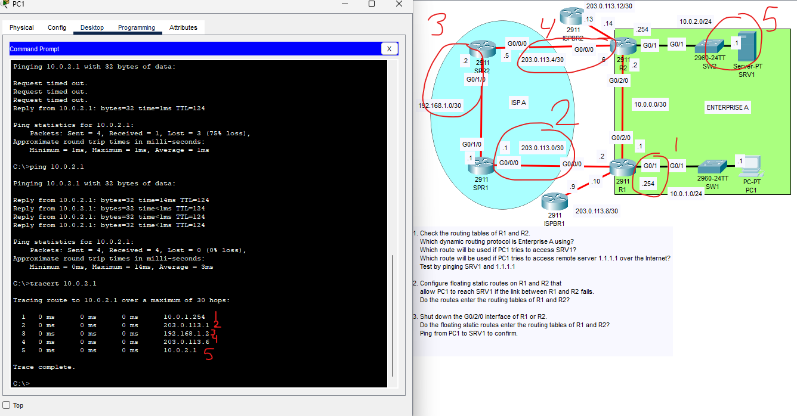

Traceroute will send an ICMP Echo Reply back at each hop, confirming the path.

This lab is now complete.

