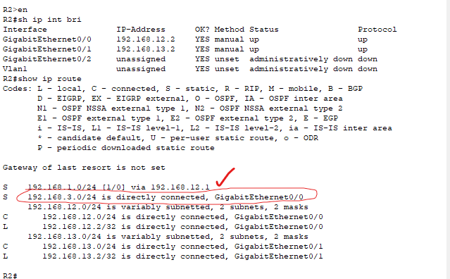

### Lab overview

### The first step is to check if a ping to PC2 works. If it doesn't, we can check if a ping to PC1's default gateway works.

This confirms that PC1 has a proper configuration to its default gateway. The issue lies elsewhere. For the sake of this lab, we will assume the switches are properly configured.

### Now we have to look through each router and find all the misconfigurations.

- For R1:

We can see that the next hop is misconfigured, it is supposed to go to 192.168.12.2, NOT 192.168.12.3. 192.168.12.2 is the correct IP address of R2's G0/0 interface. Let's fix it.

We can see that I have added a proper route to its routing table. Now all that is left is to get rid of the improper route.

With this we can remove the bad route and R1 is fully fixed!

- For R2:

The route going toward PC1's network 192.168.1.0/24 is correct. However, the route going toward PC2's network 192.168.3.0/24 is incorrect, it is using the exit interface of G0/0 when it should be using the exit interface G0/1.

We have fixed and removed the routing entry from the routing table. R2 is now fully fixed.

- For R3:

We can see that the g0/0 interface IP-address is misconfigred. It is supposed to be 192.168.13.3/24, NOT 192.168.23.3/24

Also, there is no static routing entry toward PC1's network. We will fix both of these.

We fixed the interface ip address by entering global configuration mode and then interface configuration mode on interface G0/0, from there, we just type the command 'ip address 192.168.13.3 255.255.255.0' and it will override the ip address set to it. No need to remove the interface entry.

Since the lab states there is only one misconfiguration per router, we can assume it is now fully fixed. But just making sure, we can see the routing table now has its static route to PC1's network.

### Now  we check with a ping to confirm all routing entries are fixed.

### Success!

This lab is now complete.
