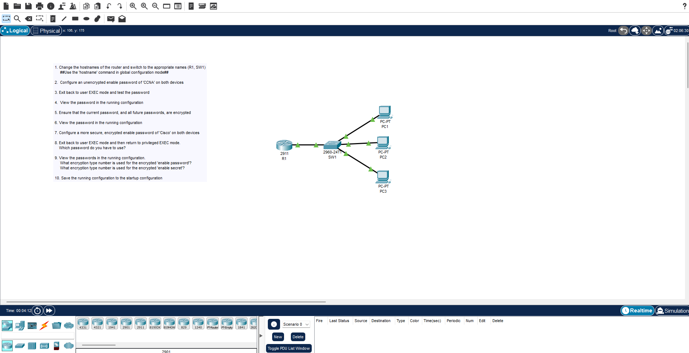
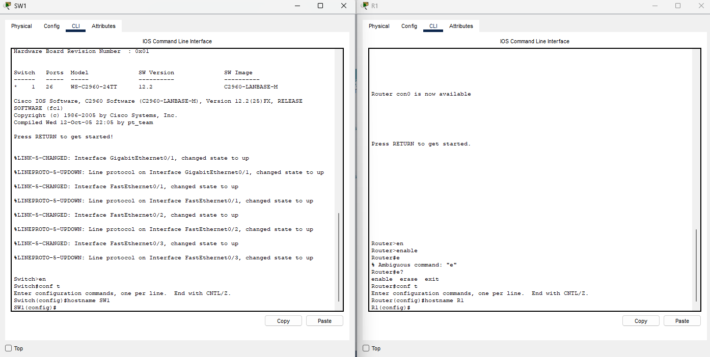
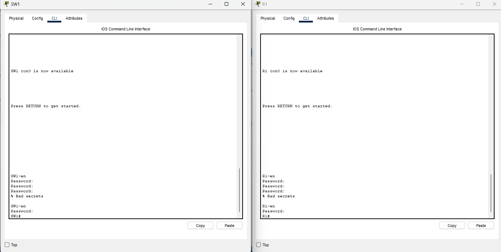
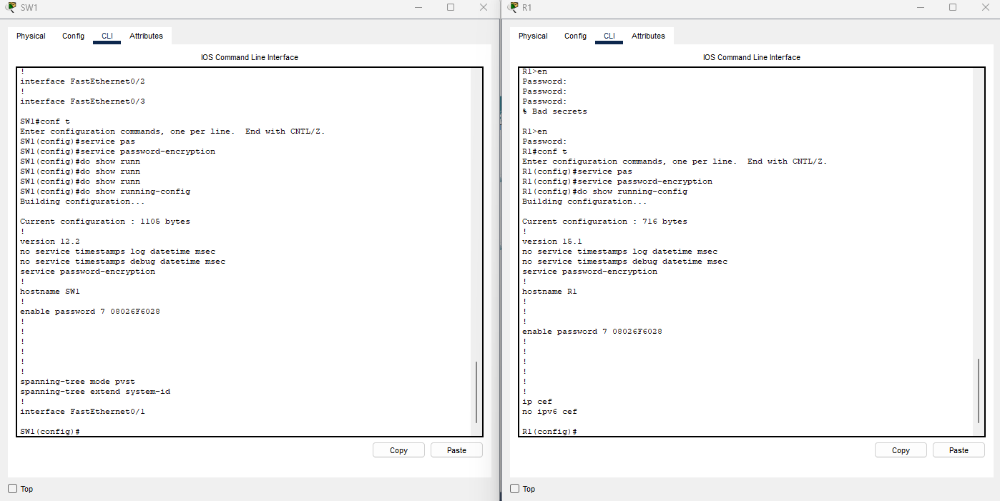
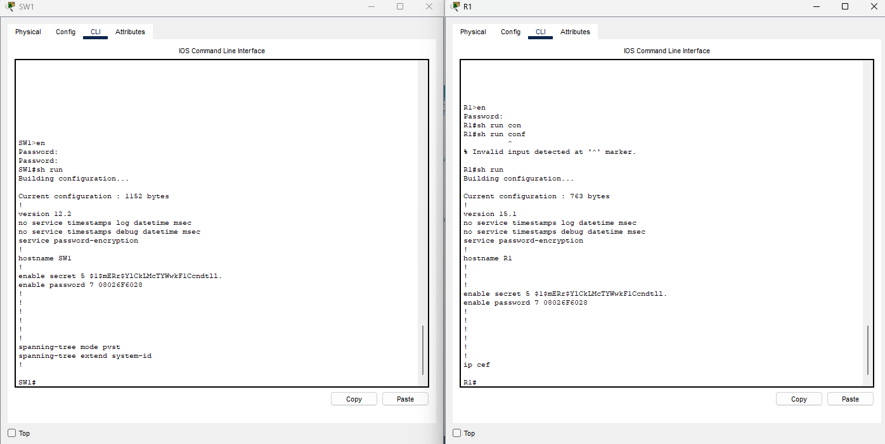
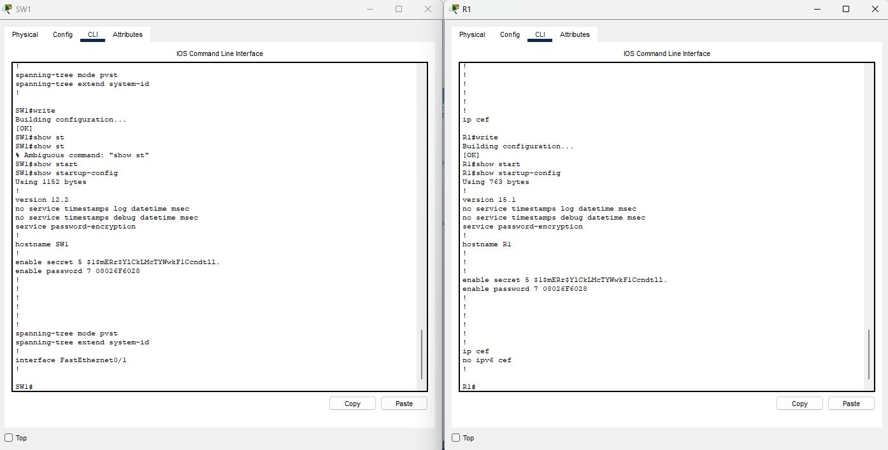

### Initial network topology and instruction

### Changed the hostname of both R1 and SW1 from "Router" and "Switch" to "R1" and "SW1" from global configuration mode)

### Enabled unencrypted password for R1 and SW1 for privileged EXEC mode

### Enabled a type 7 encrypted password for R1 and SW1 'service password-encryption'

### Enabled a MD5 encrypted password for R1 and SW1 (trumps the former passwords) 'enable secret [password]'

### Save the configuration to startup config using the 'write' command

